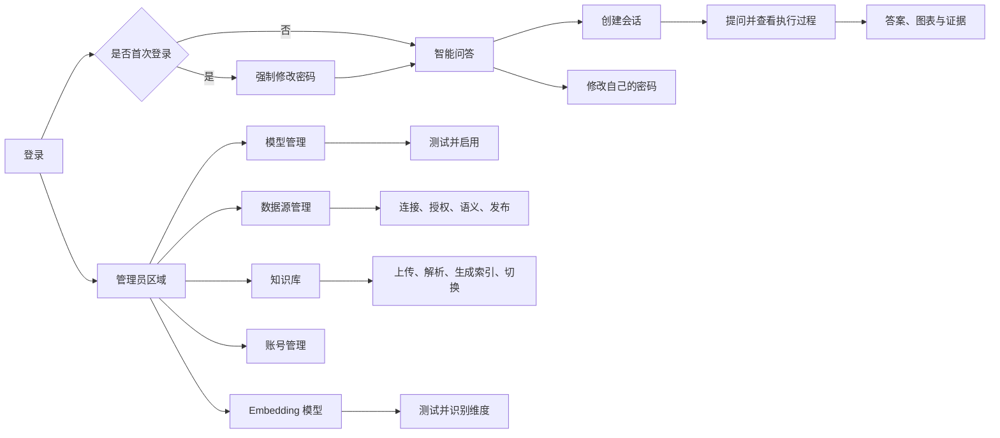

# 智能体问答与数据分析平台——Google Stitch 前端页面设计说明

- 文档版本：1.0
- 日期：2026-09-23
- 用途：作为 Google Stitch 生成、迭代 Web 端 UI 的页面描述与提示词基准
- 产品依据：[PRD v1.0](./PRD.md)
- 技术依据：[技术设计 v1.2](./技术设计.md)
- 目标端：桌面端优先的内部管理与业务问答 Web 应用
- 设计语言：简体中文

## 1. 文档使用方式

Google Stitch 支持通过自然语言生成界面、通过对话继续调整主题和布局，并可将结果导出到 Figma 或前端代码。本项目页面较多，不建议一次要求 Stitch 生成所有页面，否则容易丢失状态和交互细节。建议按以下顺序使用：

1. 先提交第 2 节“全局项目提示词”，生成统一的应用外壳和视觉方向。
2. 再逐页提交第 8～14 节中的“Stitch 分页面提示词”，每次只设计一个页面或一个紧密相关的页面组。
3. 将上一张已满意的页面作为视觉参考图上传，再生成下一张页面，保持导航、颜色、间距、组件和字体一致。
4. 每个核心页面至少生成桌面默认状态，并根据文档补充生成加载、空状态、失败、无权限等关键变体。
5. 最终将页面整理到 Figma，检查组件复用、文本完整性、不同状态以及页面之间的跳转关系。

本文件描述的是产品界面和交互，不要求 Stitch 实现真实后端、模型调用、SQL 执行或文件解析。原型中的数据使用明确的示例内容，不能把示例凭证、真实业务数据或真实连接地址放进设计稿。

## 2. 可直接提交给 Stitch 的全局项目提示词

> 设计一个桌面端优先、简体中文的企业内部 Web 应用，产品名称为“智能分析平台”。它帮助业务人员选择已配置的大模型和一个数据源，用自然语言查询 MySQL、Elasticsearch 或文档知识库，并查看可核查的执行过程、证据和最终结论。管理员还可以配置模型、数据源、知识库和账号。
>
> 整体风格专业、克制、可信、偏数据产品，不要像营销网站，也不要使用大面积渐变、玻璃拟态、插画或夸张的 AI 发光效果。使用浅色主题，主色为沉稳的蓝色，背景为浅灰白，正文为深灰，成功使用绿色，警告使用琥珀色，错误使用红色。页面需要清晰区分“模型生成内容”“真实查询结果”“证据引用”“系统状态”。
>
> 应用采用左侧固定导航栏、顶部全局栏、右侧主内容区。左侧导航包含：智能问答、模型管理、数据源管理、知识库、账号管理。普通用户只看到“智能问答”；管理员看到全部菜单。顶部栏包含当前页面标题、必要的页面操作、用户头像与账号菜单。内容最大宽度适合 1440px 桌面屏，同时支持 1280px；不要把主要内容限制成过窄的手机式卡片。
>
> 设计遵循 8px 间距体系，圆角适中，边框轻而清晰，阴影很弱或不用阴影。表格、表单、抽屉、模态框、标签、步骤时间线、代码块、文件列表和聊天消息应形成一致的组件系统。操作按钮层级明确：一个区域最多一个主要按钮，危险操作使用红色并要求二次确认。
>
> 问答页面是产品核心：左侧是会话列表，中间是对话和答案，右侧可展开执行过程与证据。答案不能展示模型内部思维链，只展示可审计的步骤：“已确认条件、选择的数据源、实际查询或文档检索、找到的证据、生成结论”。SQL 和 Elasticsearch DSL 使用等宽字体代码块，默认折叠技术细节。证据必须能点击查看来源。运行状态、无数据、证据不足、失败、停止、超时必须使用不同文本和视觉状态，不能都显示成普通错误。
>
> 所有页面都需要设计：正常状态、加载状态、空状态、表单校验、接口失败和无权限状态。不要显示真实 API Key 或密码，密钥字段仅显示掩码和“替换密钥”操作。界面文案使用真实中文，不使用 Lorem Ipsum。图标使用统一的简洁线性图标。

## 3. 产品与角色背景

### 3.1 产品目标

用户进入平台后，不需要编写 SQL 或 Elasticsearch DSL。用户先选择一个已启用模型，再选择一个数据源，然后输入自然语言问题。平台执行受控查询或文档检索，返回带来源的分析答案。用户可以查看实际执行过的查询、证据片段、数据限制，并下载 Markdown 报告或 CSV 结果。

### 3.2 用户角色

**普通用户**

- 登录后只访问智能问答。
- 使用管理员已经启用的模型和数据源。
- 新建、查看、重命名、删除自己的会话。
- 提问、追问、回答澄清问题、停止任务。
- 查看自己的执行步骤、证据、查询结果和导出文件。
- 不能看到模型密钥、数据源凭证或管理菜单。

**管理员**

- 拥有普通用户的问答能力。
- 配置并测试 OpenAI、Ollama 模型及独立的嵌入模型。
- 配置 MySQL 和 Elasticsearch 数据源，选择授权表、索引和字段，维护业务含义与指标口径。
- 创建知识库、上传和更新文档、处理失败重试、重建向量索引。
- 创建、停用账号和重置密码。
- 管理员默认不能浏览其他用户的对话内容，因此账号管理页不能提供“查看该用户会话”的入口。

## 4. 全局信息架构

### 4.1 页面清单

1. 登录页。
2. 智能问答页：包含会话列表、新建会话、对话、执行过程、证据和结果预览。
3. 模型管理列表页。
4. 模型新建/编辑页，包含连接与能力测试。
5. 数据源管理列表页。
6. MySQL 数据源新建/编辑流程。
7. Elasticsearch 数据源新建/编辑流程。
8. 数据源业务语义与指标口径配置页。
9. 知识库列表页。
10. 知识库详情页，包含文档管理、版本、处理任务和重建索引。
11. 嵌入模型配置页，可作为知识库模块中的二级页面。
12. 账号管理页。
13. 修改密码页或账号菜单中的修改密码对话框。
14. 通用 403、404、系统异常页面。

### 4.2 导航结构

桌面端左侧导航宽度约 224px，可折叠到只显示图标的 64px。顶部放产品标识与“智能分析平台”文字，下方为菜单。当前菜单用浅蓝底、蓝色图标和中等字重突出，不使用厚重色块。

菜单顺序：

- 智能问答：消息气泡或星形对话图标。
- 模型管理：芯片或模型图标，仅管理员可见。
- 数据源管理：数据库图标，仅管理员可见。
- 知识库：文件夹或文档图标，仅管理员可见。
- 账号管理：用户组图标，仅管理员可见。

导航底部可显示应用版本与“需求/帮助”入口占位，但第一版不设计复杂帮助中心。不要加入计费、插件市场、智能体编排、监控大屏等 PRD 外功能。

顶部栏高度约 56～64px，左侧为页面标题或面包屑，右侧为用户菜单。用户菜单显示用户名、角色标签、修改密码、退出登录。管理员页面的“新建”按钮可放在页面标题区右侧。

## 5. 视觉设计系统

### 5.1 设计气质

关键词：专业、清晰、可信、可追溯、高信息密度但不拥挤。视觉参考方向接近成熟的企业数据管理工具和开发者控制台。AI 只是能力，不应以紫色霓虹、机器人插画或魔法光效主导界面。

### 5.2 色彩建议

- 主色：蓝色，建议接近 `#2563EB`，用于主要按钮、选中状态和链接。
- 主色浅背景：接近 `#EFF6FF`，用于选中菜单、信息提示和轻量高亮。
- 页面背景：接近 `#F7F8FA`。
- 卡片及内容背景：白色。
- 主文字：接近 `#1F2937`；次文字接近 `#6B7280`；弱文字接近 `#9CA3AF`。
- 边框：接近 `#E5E7EB`。
- 成功：绿色；警告：琥珀色；失败：红色；运行中：蓝色；已停止：中性灰色。
- SQL、DSL 和技术详情代码块使用深色文字配浅灰背景，避免整页深色终端风格。

颜色不能成为唯一的状态表达方式。状态同时显示图标和文字，例如“处理失败”“证据不足”“已停用”。

### 5.3 字体、间距与尺寸

- 中文界面优先使用系统无衬线字体，如 PingFang SC、Microsoft YaHei、Noto Sans CJK SC。
- 正文 14px，表单标签 14px，辅助文本 12px，页面标题 22～24px，区域标题 16～18px。
- 数据、SQL、DSL、模型标识使用等宽字体。
- 采用 8px 间距体系；页面水平留白 24～32px；卡片内边距 20～24px。
- 输入框与常规按钮高度约 36～40px；关键提问输入区可更高。
- 圆角 6～10px，不使用胶囊形态覆盖所有组件。

### 5.4 公共组件

- 按钮：主要、次要、文字、危险四级；按钮必须有加载和禁用状态。
- 状态标签：启用、停用、草稿、测试中、测试通过、测试失败、处理中、可检索等。
- 表单：标签在控件上方，必填项有明确标记，帮助文字紧贴字段。
- 表格：固定表头、行悬停、分页或游标加载；操作列放少量常用操作，其他收入“更多”菜单。
- 空状态：简洁线性图标、原因说明、一个明确行动按钮。
- Toast：用于短暂成功反馈；需要用户处理的错误保留在页面内，不只显示瞬时 Toast。
- 抽屉：用于证据详情、SQL/DSL 详情和文档引用，桌面宽度约 520～720px。
- 对话框：用于删除、停用、替换版本、重置密码等短操作；复杂配置使用独立页面。
- 代码块：带语言标签、复制按钮、自动换行开关；默认隐藏敏感参数。
- 数据表预览：显示列类型、NULL、截断提示和下载入口。

## 6. 全局交互和状态规则

### 6.1 加载

- 页面首次加载使用骨架屏，不用全屏旋转图标遮住导航。
- 表格刷新只在表格区域加载。
- 主要按钮提交后保留原文并显示加载，不允许用户重复点击。
- 运行中的问答必须持续显示阶段和耗时，不能长时间只显示“思考中”。

### 6.2 空状态

- 普通用户没有可用模型或数据源：说明“暂时没有可用配置，请联系管理员”，不显示无效的提问框。
- 管理员没有配置：提供“新建模型”“新建数据源”或“创建知识库”按钮。
- 会话为空：展示欢迎标题、简短能力说明和 3～4 个示例问题，但示例不能承诺跨数据源分析。
- 搜索无结果：保留搜索条件，显示清空筛选入口。

### 6.3 错误与权限

- 表单字段错误放在字段下方。
- 连接测试失败在测试区域显示原因、时间和“重新测试”，不清空已填写内容。
- 页面级失败显示可重试区域，保留导航和页面标题。
- 无权限使用独立 403 页面，说明当前账号没有权限并提供返回入口。
- 资源不存在或已删除使用 404 页面。
- 普通用户访问不属于自己的任务时按“资源不存在”处理，界面不暗示资源属于其他人。

### 6.4 危险操作

删除会话、移除文档、停用账号、停用模型和数据源都必须二次确认。确认框具体说明影响，按钮写清动作，如“确认停用模型”，不能只写“确定”。删除和停用必须区分：停用保留历史，删除会清理可访问内容。

### 6.5 可访问性

- 所有表单标签与控件正确对应。
- 键盘可访问侧栏、对话输入、抽屉和对话框。
- 焦点轮廓清晰。
- 图标按钮提供文字提示和无障碍名称。
- 状态不只依赖颜色；错误信息可被屏幕阅读器读取。
- 对话和步骤新增内容不要突然抢走键盘焦点。

## 7. 跨页面核心对象的显示规范

### 7.1 模型选项

显示模型配置的“显示名称”，次行显示提供方与实际模型标识，例如：

```text
GPT-4.1 业务分析
OpenAI · gpt-4.1
```

不要向普通用户显示 API Key、完整服务地址或内部配置版本号。停用模型不出现在新会话选项中。

### 7.2 数据源选项

每个选项显示名称、类型、业务说明和状态：

```text
销售分析库
MySQL · 订单、退款和区域维度 · Asia/Shanghai
```

知识库额外显示可检索文档数；ES 显示单个索引的业务名称，不需要普通用户看到完整服务地址。

### 7.3 任务状态

- 待执行：灰色时钟，“等待执行”。
- 运行中：蓝色动态进度，“正在查询数据”或当前阶段。
- 待澄清：琥珀色问号，“需要补充信息”。
- 已完成：绿色对勾。
- 无匹配数据：中性搜索图标，说明查询成功但没有符合条件的数据。
- 证据不足：琥珀色盾牌或信息图标，说明仅有部分证据或无法可靠回答。
- 失败：红色错误图标，提供可重试或修改问题建议。
- 已停止：灰色停止图标。
- 已超时：红色或琥珀色时钟，说明超过时间限制。

“取消处理中”是运行中的过渡提示，不是独立最终状态。停止按钮点击后立即禁用，显示“正在停止…”。

### 7.4 来源类型

- MySQL 来源：数据库图标，标题显示结果集名称，详情显示实际 SQL、参数、列和行数。
- Elasticsearch 来源：搜索图标，标题显示查询/聚合名称，详情显示 DSL、命中关系、分片和近似/截断信息。
- 文档来源：文档图标，标题显示文档名称与版本，详情显示引用片段和页码、标题路径或行号。

## 8. 登录页

### 8.1 页面目标

让内部用户使用管理员分配的账号密码登录。第一版不提供注册、短信登录、第三方登录或找回密码流程。首次登录或管理员重置密码后，用户必须修改密码。

### 8.2 布局

使用简洁的居中登录面板。桌面页面可分为左右两区，但左侧只能是克制的产品介绍或抽象数据图形，不使用人物插画和营销口号。更推荐 420～460px 宽的登录卡片居中，背景为浅灰白。

登录面板内容从上到下：

1. 产品标识与“智能分析平台”。
2. 副标题：“使用数据与证据驱动业务问答”。
3. 用户名字段。
4. 密码字段，带显示/隐藏按钮。
5. “记住用户名”复选框；不要设计长期记住密码。
6. 全宽主要按钮“登录”。
7. 底部弱提示：“账号由管理员创建，如无法登录请联系管理员。”

### 8.3 状态与交互

- 默认状态：登录按钮可用。
- 字段为空：离开字段或提交后显示“请输入用户名”“请输入密码”。
- 提交中：按钮显示“正在登录…”并禁用输入和重复提交。
- 凭证错误：卡片顶部显示内联错误“用户名或密码错误”，不要说明是哪一项错误。
- 账号停用：显示“当前账号已停用，请联系管理员”。
- 请求过多：显示“尝试次数过多，请稍后再试”。
- 网络失败：显示“暂时无法连接服务，请检查网络后重试”。保留用户名，不保留密码。
- 登录成功：进入智能问答页；管理员也默认进入智能问答，不强制进入管理后台。
- 必须修改密码：进入全屏修改密码页或阻断式对话框，包含临时密码、新密码、确认新密码、密码规则和“完成修改”。用户完成前不能进入其他页面。

### 8.4 Stitch 分页面提示词

> 设计“智能分析平台”的企业内部登录页，简体中文，桌面端 1440×900。浅灰白背景，中间是宽约 440px 的白色登录卡片，视觉专业克制。卡片包含产品名称、副标题、用户名、密码、显示密码图标、“记住用户名”、蓝色全宽登录按钮以及联系管理员提示。不要注册、忘记密码、社交登录、营销导航和夸张插画。同时展示一个凭证错误变体：卡片顶部出现清晰但不泄露细节的红色内联错误，用户输入仍保留。

## 9. 智能问答页

### 9.1 页面目标

这是普通用户和管理员的核心工作区。用户管理自己的会话、选择模型和一个数据源、提问与追问、查看执行过程和证据、预览结构化结果并下载报告。

### 9.2 桌面布局

在全局导航右侧，问答工作区采用三栏结构：

- 会话栏：宽约 260px。
- 对话主栏：最小宽度约 620px，自适应占据主要空间。
- 执行过程栏：默认宽约 360px，可折叠。证据详情再从最右侧覆盖打开 560～680px 抽屉。

在 1280px 宽度时执行过程栏默认折叠成右侧按钮；会话栏可手动折叠。在平板窄屏时不强求三栏并排：会话和过程改为抽屉，主对话保持完整。

### 9.3 会话栏

顶部是“新建会话”主要按钮，下方是搜索框“搜索会话”。会话按“今天、昨天、最近 7 天、更早”分组，每项显示自动生成或用户修改的标题、最后更新时间和当前状态小点。

会话项行为：

- 点击切换会话。
- 当前会话使用浅蓝背景突出。
- 悬停显示更多菜单：重命名、删除。
- 运行中的会话显示蓝色进度点；待澄清显示琥珀点；失败显示红点。
- 删除弹窗说明“删除后将无法查看消息、执行记录和下载文件”，按钮“确认删除会话”。
- 搜索无结果显示小型空状态，不遮挡“新建会话”。

### 9.4 新建会话状态

对话主栏顶部显示模型与数据源两个选择器：

1. 模型选择器：必选，只列出已启用且通过必要能力测试的模型。
2. 数据源选择器：必选，按 MySQL、Elasticsearch、文档知识库分组。

选择器下方显示所选项摘要。数据源摘要说明可查询范围、默认时区或可检索文档数量，帮助用户提出合适问题。

主区域中央显示：

- 欢迎标题：“今天想分析什么？”
- 说明：“选择一个模型和数据源，用自然语言提问。回答将展示查询、证据和结论。”
- 3～4 个基于当前数据源类型的示例问题。例如 MySQL：“统计上个月各地区销售额”；ES：“按错误类型统计昨天的错误记录”；文档：“退款制度适用于哪些订单？”
- 大型多行提问框，placeholder 为“请输入问题，尽量说明时间范围、指标和筛选条件”。
- 发送按钮；可提示 `Enter` 发送、`Shift + Enter` 换行。

模型或数据源未选择时，发送按钮禁用并说明缺少哪一项。首次问题发送后，顶部选择器变为只读摘要，并出现“新建会话以更换模型或数据源”的提示链接。

### 9.5 对话消息

用户消息靠右或使用淡蓝背景，显示问题和时间。助手回答靠左，占较宽内容区，不使用聊天气泡挤压长报告。回答卡片结构：

1. 状态行：已完成/证据不足等状态、模型显示名称、完成时间、总耗时。
2. “结论”区域：先给直接答案，支持标题、列表和小型数据表。
3. “口径与范围”：时间范围、指标口径、过滤条件，用浅色信息块呈现。
4. “来源”：可点击的引用标签，如“销售结果集 1”“退款制度.pdf · 第 3 页”。
5. “限制”：仅在存在截断、近似统计、部分文档未处理或其他限制时显示。
6. 操作栏：复制答案、查看过程、下载报告；有结构化结果时再显示“下载 CSV”。

回答中的事实引用采用上标或内联编号 `[1]`，点击打开证据抽屉。不要把来源堆成普通 URL 列表。

### 9.6 提问输入区

固定在对话主栏底部，但不能覆盖最后一条消息。输入框根据内容增高，最大约 160px。运行时输入区显示任务状态和停止按钮，发送按钮禁用。任务资源释放后才恢复发送。

追问默认继承会话中的已确认条件。输入区上方可显示小型条件条：

```text
已确认：时间范围 2026-08-01 至 2026-08-31 · 销售额按支付时间计算
```

条件过多时显示前几项和“查看全部”。这不是用户自由编辑的高级查询构建器。

### 9.7 执行过程栏

标题为“执行过程”，右侧有折叠按钮。顶部显示任务状态和总耗时。主体采用纵向步骤时间线，每一步显示图标、标题、状态、开始时间和耗时：

1. 理解问题与确认条件。
2. 使用的数据源。
3. 执行查询或检索；可能出现多次修正尝试。
4. 获取证据。
5. 生成并校验结论。

步骤状态有等待、运行、成功、失败、拒绝和已停止。运行中的步骤有低调的进度动画。点击步骤展开技术摘要；数据库显示 SQL，ES 显示 DSL，文档显示检索词和命中文档。默认折叠代码，不显示模型内部完整思考、密钥、内部堆栈或未经执行的计划。

查询修正需要按尝试顺序保留，例如“查询尝试 1 · 校验未通过”“查询尝试 2 · 执行成功”，不能只展示最后一次成功。

### 9.8 证据抽屉

抽屉标题根据来源变化，例如“证据详情 · 销售结果集 1”。顶部显示来源类型、数据源名称、执行时间、配置版本提示和来源是否仍有效。

MySQL 证据内容：

- 实际执行 SQL 代码块，参数值经过安全显示。
- 查询耗时、保留行数、总行数是否已知、是否截断。
- 结果表预览，最多显示 100 行；列头显示类型和单位。
- NULL 显示为灰色 `NULL` 标签，空字符串显示为空值符号，数值 0 正常显示为 0。
- “下载此结果集 CSV”。

Elasticsearch 证据内容：

- 实际 DSL 代码块。
- 命中总数及 relation、是否超时、失败分片数。
- 聚合桶预览。
- 显示“近似计数”“仅显示前 100 个桶”“另有 N 条记录未进入当前桶”等警告。

文档证据内容：

- 文档名称、版本、文件类型。
- 高亮命中片段，但不要修改原文含义。
- PDF 显示页码；DOCX 显示标题路径或段落号；TXT 显示行号范围。
- 来源已更新或移除时显示琥珀色提示；历史片段仍可复核。

### 9.9 结构化结果预览

结果量较大时，不直接塞入答案卡片。答案中显示前几行摘要和“查看完整保留结果”。点击后在主栏或大抽屉中显示结果集：结果集标签页、列设置、水平滚动、固定表头、行号、截断说明和 CSV 下载。

不要设计前端自行排序后宣称改变分析结果。可以提供页面内的显示排序和筛选，但明确“仅影响当前预览”，导出的仍是保存的结果快照。

### 9.10 关键状态变体

**运行中**

- 助手位置显示阶段式占位，不显示虚构答案。
- 执行过程栏自动展开当前步骤。
- 底部显示“正在查询数据 · 已用时 12 秒”和“停止任务”。
- SSE 暂时断开时显示“连接已中断，正在重新连接；任务仍可能继续”，不要立即标为失败。

**待澄清**

- 助手消息使用琥珀色信息卡：“需要补充信息”。
- 展示具体问题，例如“你所说的‘上个月’是指自然月还是最近 30 天？”
- 可提供 2～4 个快捷选项，也允许自由输入。
- 用户回答后创建下一次任务，但界面仍表现为连续会话。

**无匹配数据**

- 明确说明查询成功但没有匹配记录。
- 显示已使用条件和时间范围。
- 可建议放宽筛选或检查日期，不用模型常识补写结果。
- 允许下载 Markdown 报告；没有结果集时不显示 CSV。

**证据不足**

- 使用琥珀信息卡而非红色失败卡。
- 展示已有证据和缺少的部分。
- 若有保存结果，仍可下载报告和 CSV，并标明限制。

**失败**

- 显示用户可理解的错误类型，例如“数据源连接失败”“生成的查询不符合安全规则”“模型服务暂时不可用”。
- 显示失败步骤和可行操作：重试、修改问题、联系管理员。
- 不显示完整堆栈；不提供完整分析报告下载。

**已停止/已超时**

- 保留已经发生的步骤和局部证据。
- 明确说明结果不完整，不显示为成功答案。
- 不提供完整报告；允许用户修改问题后再次发送。

### 9.11 Stitch 分页面提示词：新建会话

> 设计“智能分析平台”的智能问答主页面，新建会话状态，桌面端 1440×900，简体中文。保持全局左侧导航。问答工作区使用三栏：左侧 260px 会话列表，中间主问答区，右侧 360px 执行过程。左侧顶部有“新建会话”和搜索框，下方按今天、最近 7 天分组显示会话。中间顶部有“选择模型”和“选择数据源”两个选择器，中央显示“今天想分析什么？”、功能说明、三个与 MySQL 数据分析有关的示例问题，底部有大型多行输入框和发送按钮。右侧执行过程在未运行时显示简洁空状态。风格专业、克制、浅色、蓝色主色、高信息密度，不要营销插画、渐变和机器人形象。

### 9.12 Stitch 分页面提示词：运行与完成

> 在同一视觉系统下设计智能问答的“任务运行中”和“回答已完成”两个变体。运行中：顶部模型和数据源已锁定，中间显示用户问题和阶段式回答占位，底部显示“正在查询数据 · 已用时 12 秒”及停止按钮；右侧时间线显示理解问题、执行 SQL、获取证据、生成结论，其中执行 SQL 正在运行。完成状态：助手回答以报告式布局展示结论、口径与范围、来源引用、限制和操作栏；包含一个三列数据小表。右侧时间线全部完成，SQL 技术详情默认折叠。点击来源应打开右侧证据抽屉，抽屉中展示 SQL 代码块、查询耗时、结果预览表、截断提示和 CSV 下载按钮。不要展示模型内部思维链。

### 9.13 Stitch 分页面提示词：异常与澄清

> 设计智能问答页面的四个状态组件，保持相同布局：需要澄清、无匹配数据、证据不足、执行失败。需要澄清使用琥珀信息卡并给出快捷选项；无匹配数据说明查询成功但为零，展示实际筛选条件；证据不足展示已有证据和缺少信息；执行失败使用红色错误状态并指出失败步骤、重试和修改问题操作。四种状态的图标、标题、文案和可用操作必须明显不同，不要全部设计成相同错误卡片。

## 10. 模型管理

### 10.1 模型列表页目标

让管理员查看所有对话模型的提供方、能力测试、启用状态和最近更新时间，并进入新建、编辑、测试、启停操作。嵌入模型与对话模型必须区分，嵌入模型在知识库模块管理，不能混在普通用户的对话模型选择中。

### 10.2 模型列表页布局

页面标题“模型管理”，副标题“配置用于数据问答的 OpenAI 或 Ollama 对话模型”。右上角主要按钮“新建模型”。标题下方为筛选栏：关键词、提供方、状态、测试状态；右侧有刷新。

主内容使用表格，列建议为：

- 显示名称。
- 提供方：OpenAI / Ollama 标签。
- 实际模型标识，等宽字体。
- 服务地址，只显示域名或脱敏后的地址，悬停可查看管理员允许看到的完整非凭证地址。
- 能力状态：基础对话、工具调用、流式响应三个小状态；连接状态可合并展示。
- 发布状态：草稿、已启用、已停用、配置已变更待重测。
- 最近测试时间。
- 最近更新人和时间。
- 操作：编辑、测试、启用/停用、更多。

能力状态不能只显示一个笼统的“正常”。工具调用未通过时，即使连接成功也不能启用，需要在行内给出原因提示。

### 10.3 列表状态

- 空状态：“还没有对话模型”，按钮“新建第一个模型”。
- 测试中：能力单元格显示进度和“测试中”，行操作限制编辑和启用，允许查看任务。
- 配置变更：琥珀标签“需要重新测试”，启用按钮禁用。
- 已停用：行降低强调度，但文字保持可读；历史任务不受影响的提示放在停用确认框。

### 10.4 新建/编辑模型页

使用独立页面，不用窄小弹窗。顶部面包屑“模型管理 / 新建模型”，右侧“保存草稿”。页面分成三个清晰区域。

**基本信息**

- 显示名称：给业务用户看的名字，必填，例如“GPT-4.1 业务分析”。
- 提供方：OpenAI 或 Ollama，使用单选卡片。
- 实际模型标识：必填，等宽显示，例如 `gpt-4.1`、`qwen3:14b`。
- 备注：可选，多行文本。

**连接配置**

- 服务地址：必填；根据提供方给出示例格式，不预填真实地址。
- API Key：OpenAI 可填写，Ollama 标为可选。新建时密码型输入；编辑时显示“已配置 ••••••••”，提供“保留现有密钥”“替换密钥”“清除密钥”明确选择，不能把掩码作为值回传。
- 请求超时：数字输入，显示单位秒和平台允许范围；默认 120 秒。
- 数据发送提示：信息框说明问题、授权结构和证据摘要可能发送到该模型服务，管理员启用前需要确认。

**能力与发布**

- 连接测试卡片。
- 基础对话测试卡片。
- 工具调用测试卡片。
- 流式响应测试卡片。
- 每项显示未测试、测试中、通过、失败、测试时间和脱敏原因。
- 主要动作“运行全部测试”，次要动作可单独重试失败项。
- 只有保存配置后才能测试。
- 修改地址、模型标识或密钥后，页面顶部显示“关键配置已更改，原测试结果已失效”。

页面底部操作：返回、保存草稿、保存并测试。启用不应和首次保存混在一个不透明按钮里；测试通过后显示独立“启用模型”。

### 10.5 测试结果详情

可使用右侧抽屉展示测试任务：开始时间、结束时间、阶段、延迟、是否支持工具调用、是否支持流式、模型返回用量（如果服务提供）和脱敏错误。不要展示完整模型提示、API Key 或内部堆栈。

启用确认框显示：模型名称、提供方、模型标识、数据是否可能发送到外部服务、已通过的能力和最近业务评测结果。若业务评测未达到门槛，后端不允许启用，界面提供“查看评测报告”入口，而不是允许管理员强行跳过。

### 10.6 停用确认

文案示例：

```text
停用“GPT-4.1 业务分析”？
停用后不能再用它发起新问题。正在运行的任务会继续使用当前配置完成，历史会话和报告仍可查看。
```

按钮为“取消”和“确认停用模型”。

### 10.7 Stitch 分页面提示词：模型列表

> 设计企业内部“模型管理”页面，简体中文，管理员视角。使用既定左侧导航和浅色蓝色设计系统。页面标题下有关键词、提供方、状态和测试状态筛选；右上角“新建模型”。主表格展示显示名称、OpenAI/Ollama 提供方、实际模型标识、脱敏服务地址、基础对话/工具调用/流式三个能力状态、启用状态、最近测试时间和操作。示例中一行全部通过并已启用，一行连接通过但工具调用失败，一行配置变更后等待重测。不要显示真实密钥。

### 10.8 Stitch 分页面提示词：模型编辑

> 设计“新建/编辑对话模型”独立页面，分为基本信息、连接配置、能力与发布三部分。字段包含显示名称、OpenAI/Ollama 提供方、服务地址、实际模型标识、API Key 掩码与替换操作、请求超时、备注。下方用四个紧凑状态卡展示连接、基础对话、工具调用、流式响应测试，并提供“运行全部测试”。展示一个“关键配置已更改，原测试已失效”的琥珀提示。页面底部有返回、保存草稿、保存并测试；测试通过后才显示启用按钮。风格专业、表单清晰，不使用向导式营销插画。

## 11. 数据源管理

### 11.1 数据源列表页

页面标题“数据源管理”，副标题“管理可用于智能问答的 MySQL 数据库和 Elasticsearch 索引”。右上角“新建数据源”，点击后弹出类型选择：MySQL、Elasticsearch。知识库在独立模块管理，不从此处上传文档，但发布后的知识库可以作为问答数据源。

筛选栏：关键词、类型、状态、连接状态。表格列：

- 数据源名称。
- 类型。
- 目标摘要：MySQL 显示数据库名和主机脱敏摘要；ES 显示具体索引名。
- 授权范围：授权表数量或可查询字段数。
- 业务配置：指标口径数量或字段说明完成度。
- 连接/结构状态：连接成功、结构已刷新、结构可能变化。
- 发布状态。
- 最近刷新时间。
- 操作：编辑连接、配置业务语义、测试、发布/停用、更多。

如果连接成功但没有授权表或业务说明，状态应显示“配置未完成”，不能只显示绿色连接成功。

### 11.2 通用新建流程

复杂数据源配置采用顶部步骤条，但不要做成一次性全屏魔法向导。步骤：

1. 基本信息与连接。
2. 选择授权范围。
3. 配置字段与业务语义。
4. 校验并发布。

管理员可保存草稿稍后继续。每步切换前只校验该步必要字段。顶部始终显示数据源名称和草稿状态。

### 11.3 MySQL：连接配置

字段：

- 数据源名称。
- 主机、端口、数据库名。
- 用户名、密码；密码编辑采用保留/替换逻辑。
- 默认时区，默认 `Asia/Shanghai`。
- 备注与业务用途。

页面用蓝色信息提示强调“请使用只读账号”。连接测试区显示连接、数据库版本、只读权限检查结果和耗时。若账号拥有写权限，显示红色或琥珀色阻断提示：“当前账号包含写入或管理权限，不能发布，请更换只读账号”。不要提供在平台内自动降权或执行授权 SQL 的按钮。

### 11.4 MySQL：授权表与关系

页面左侧为表/视图列表，带搜索、全选当前页和类型筛选；右侧为选中表详情。每个表显示名称、类型、字段数量、主键状态和管理员填写的业务用途。

选中表详情包含：

- 表用途描述，必填后才能发布。
- 字段表格：字段名、数据库类型、允许查询开关、业务名称、业务说明、敏感性提示。
- 关联关系区域：源表/字段、目标表/字段、关系类型、说明。系统读取到的外键用“数据库关系”标签，管理员添加的用“业务关系”标签。
- 结构 hash 和最近刷新时间放在高级信息中。

授权范围不能使用“允许全部未来表”这种模糊开关。结构刷新发现新增、删除或类型变化时，以对比视图展示，并要求管理员确认更新。

### 11.5 MySQL：业务指标口径

页面标题区域说明“模型将使用这些口径理解业务问题”。主要内容为指标列表与右侧编辑面板。

指标列表字段：名称、单位、时间字段、依赖表、状态。编辑面板字段：

- 指标名称，例如“销售额”。
- 业务说明。
- 计算表达式或结构化规则，使用受控表达式编辑器，不做任意 SQL 大文本框。
- 时间字段。
- 固定过滤条件，例如订单状态。
- 是否扣除退款等业务规则。
- 单位、小数位和舍入规则。
- 适用范围和示例问题。

页面提供“预览口径摘要”，用自然中文显示：“销售额按支付时间统计，仅包含已支付和已完成订单，并扣除成功退款金额。”这段摘要会给业务用户复核。

### 11.6 MySQL：发布检查

用检查清单展示：连接通过、账号只读、至少选择一个表、表用途已填写、字段配置有效、关系可验证、关键指标完整、数据发送范围已确认。每项可点击返回相应步骤。全部通过后“发布数据源”按钮可用。

### 11.7 Elasticsearch：连接配置

字段：数据源名称、服务地址、认证方式、用户名/密码或 API Key、一个具体索引名、默认时间字段、默认时区、业务用途。

明确提示：第一版只允许一个具体索引，不接受通配符、多索引和数据流。连接测试结果显示 ES 版本、索引是否存在、索引 UUID、分片状态和 mapping 读取结果。

### 11.8 Elasticsearch：字段配置

以字段表格为核心，列为：字段名、类型、业务名称、用途说明、全文检索、可过滤、可排序、可聚合。开关根据 mapping 自动约束：

- text 可以作为全文检索字段，但不能直接开放 terms 聚合。
- keyword、numeric、date 等根据能力开放过滤/聚合。
- keyword 如果禁用 `doc_values`，可聚合和排序开关禁用，并显示说明。
- date 字段可设置为默认时间字段。
- 未知或复杂对象字段默认不开放。

页面右侧或底部显示“能力验证”区域，用无副作用的小型查询检查已选择的聚合字段。若某字段类型看似支持但实际查询失败，显示失败并阻止发布。

### 11.9 Elasticsearch：查询规则与发布

配置全文检索字段、允许过滤字段、允许排序字段、允许聚合字段、默认时间范围建议和业务说明。显示平台固定限制：最多 100 个聚合桶、最长 30 秒、单结果集最多保留 1000 行。管理员可以理解限制，但第一版不一定允许在页面任意扩大系统上限。

发布检查：连接、单索引身份、mapping、字段能力、时间字段、业务用途、认证和数据发送确认。索引同名但 UUID 变化时，列表和编辑页显示阻断警告“索引身份已变化，请刷新并重新确认字段”。

### 11.10 结构刷新对话框

点击“刷新结构”后先读取最新 metadata/mapping，再展示差异：新增字段、移除字段、类型变化、能力变化。管理员选择“接受新结构并创建草稿版本”或取消。已发布版本在新版本发布前继续服务；不要直接在后台静默替换。

### 11.11 Stitch 分页面提示词：数据源列表

> 设计管理员“数据源管理”列表页，简体中文。标题区有“新建数据源”，筛选栏包含关键词、类型、状态和连接状态。表格同时展示 MySQL 与 Elasticsearch 示例：名称、类型、目标摘要、授权范围、业务配置完成度、连接与结构状态、发布状态、最近刷新时间、操作。一个 MySQL 行显示连接正常但账号不是只读，因此不能发布；一个 Elasticsearch 行显示已发布；另一个显示索引结构变化待确认。界面应让“连接成功”和“可发布”明显是不同概念。

### 11.12 Stitch 分页面提示词：MySQL 配置

> 设计 MySQL 数据源配置的四步管理页面：连接、授权范围、业务语义、发布检查。当前展示“授权范围与业务语义”步骤。左侧是带搜索的表/视图列表，中间是字段表格，右侧是表用途和关联关系编辑；页面下方有业务指标列表与指标编辑面板。字段包含数据库字段名、类型、业务名称、说明和允许查询开关。使用真实中文示例，如 orders、refunds、销售额、支付时间、订单状态。顶部保留草稿状态和步骤条，底部有上一步、保存草稿、下一步。

### 11.13 Stitch 分页面提示词：Elasticsearch 配置

> 设计 Elasticsearch 数据源配置页面，桌面端企业后台。顶部步骤条为连接、字段能力、查询规则、发布检查。当前页面显示字段能力：表格列出字段名、mapping 类型、业务名称、全文检索、过滤、排序、聚合开关。示例中一个 keyword 字段因为 doc_values 被禁用，所以排序和聚合开关不可用，并有明确说明；一个 text 字段只能全文检索；一个 date 字段被选为默认时间字段。右侧或底部显示小型能力测试结果。强调第一版只允许一个具体索引，不支持通配符和多索引。

## 12. 知识库与 Embedding 模型

### 12.1 页面目标

知识库管理用于把业务文档转换为可检索的知识，并通过独立的 Embedding 模型完成向量化。界面必须让管理员清楚区分四件事：原始文档是否上传成功、文档是否解析成功、向量索引是否生成成功、当前线上检索使用哪个索引版本。不要把这些状态压缩成一个含义模糊的“成功”。

Embedding 模型与对话模型是两类配置。页面文案、导航入口和选择器标签都必须明确区分，避免管理员误用对话模型生成向量。

### 12.2 知识库列表 `/admin/knowledge-bases`

页面标题为“知识库”，副标题为“管理业务文档、解析状态和向量索引版本”。右上角主按钮“新建知识库”。

筛选区包含关键词、启用状态、索引状态和 Embedding 模型。列表每行显示：

- 知识库名称与说明摘要。
- 当前有效文档数，以及处理中、失败文档数。
- 使用的 Embedding 模型名称和向量维度。
- 当前在线索引版本，例如 `generation-20260923-02`。
- 索引状态：未生成、生成中、可检索、重建失败、等待切换。
- 启用状态和最近更新时间。
- 操作：查看、上传文档、重建索引、编辑、启用或停用。

列表顶部显示容量摘要：“已启用 3 个知识库，共 64 份有效文档”。接近第一版每库 100 份有效文档的上限时显示容量提示。停用知识库需要确认，并说明停用后新问题不会再检索其中的文档，已有会话记录不受影响。

空状态说明知识库的用途，并提供“新建知识库”按钮。筛选无结果时保留筛选条件，提供“清除筛选”。

### 12.3 新建知识库

采用两步流程：

1. 基本信息：名称、用途说明、适用业务范围、是否启用。
2. 检索配置：选择已启用且测试通过的 Embedding 模型，展示模型供应商、模型名、向量维度和最近测试时间；配置默认召回数量、相似度阈值等经过产品允许的参数。

如果没有可用的 Embedding 模型，选择器显示空状态和“前往配置 Embedding 模型”链接。创建知识库不会假装已经可检索；创建完成后进入详情页，并引导上传文档和生成首个索引。

### 12.4 知识库详情

标题区显示名称、启用状态、当前在线索引版本、Embedding 模型以及操作按钮“上传文档”“重建索引”“编辑”。正文使用四个页签：

- “概览”：用途、文档统计、索引健康状态、最近任务和配置摘要。
- “文档”：文档列表、版本、解析状态和操作。
- “索引与检索”：索引代次、生成进度、切换记录和检索测试。
- “设置”：基本信息、Embedding 模型及停用操作。

概览页用小型统计卡展示有效文档、处理中、失败、当前索引文档数，不设计经营驾驶舱或与知识库无关的趋势图。

### 12.5 文档上传对话框

上传区支持拖放和文件选择，接受 PDF、DOCX、TXT。明确显示单文件最大 20 MB、单个知识库最多 100 份有效文档。已选文件列表展示文件名、类型、大小、校验结果和移除按钮。

上传前执行前端校验：不支持的格式、超出大小、空文件、超过文档数量上限。错误直接显示在对应文件行，合法文件仍可继续上传。主按钮显示“上传 3 个文件”，上传过程中显示单文件进度和总进度，不允许重复提交。

系统识别到同内容 hash 时，提示“此内容已存在”，默认不重复导入；同名但内容不同则提示“将作为新版本上传”，要求用户确认。不要仅凭文件名静默覆盖。

上传完成后显示结果摘要：成功、重复、失败各多少份。成功只代表文件已接收，后续状态显示为“排队解析”或“解析中”，不能立即标成“可检索”。

### 12.6 文档列表与详情

文档列表包含：文档名、版本、格式、大小、解析状态、索引状态、上传人、上传时间、最近错误和操作。状态使用以下固定词汇：

- 排队解析：文件已接收，尚未开始。
- 解析中：正在提取文字和结构。
- 解析失败：无法进入索引，可查看原因并重试。
- 待生成索引：解析完成，但当前在线索引尚未包含它。
- 可检索：已进入当前在线索引。
- 已移除：不再用于下一代索引。

点击文档打开详情抽屉，展示版本历史、文件元数据、解析摘要、页数或段落数、错误详情以及是否包含在当前在线索引中。对失败文档提供“重试解析”；对有效文档提供“上传新版本”和“移除”。移除需要确认，文案说明它要在下一次索引生成并切换后才会从检索结果中消失。

### 12.7 索引生成与原子切换

“重建索引”打开确认对话框，列出将纳入、更新、移除和跳过的文档数量。若存在解析失败文档，提示这些文档不会进入新索引，让管理员选择继续生成或返回处理；不能把失败文档静默计入成功数量。

生成任务面板显示：任务编号、开始时间、当前阶段、完成比例、已处理文档数、失败文档数和可展开日志摘要。阶段文案依次为“准备文档”“生成向量”“写入新索引”“验证新索引”“切换在线版本”。

生成期间旧索引继续在线，顶部信息条写明“当前检索仍使用 generation-20260921-01”。只有新索引完整写入并通过验证后才原子切换。失败时显示“重建失败，线上索引未变化”，并提供重试和查看详情。切换成功后，新加入文档变为“可检索”，被移除文档变为“已移除”。

索引历史以时间线展示代次、文档数、向量数、使用模型、维度、创建结果、切换时间和操作者。Embedding 模型或维度改变时，必须提示需要完整重建，不能只做增量更新。

### 12.8 检索测试

“索引与检索”页签提供管理员测试框。输入一段自然语言后，展示召回片段、文档名、版本、页码或段落定位、相似度和内容摘要。该功能只验证检索，不调用对话模型，不生成最终答案。无结果时给出调整问题或检查索引状态的建议。

### 12.9 Embedding 模型列表 `/admin/embedding-models`

页面标题“Embedding 模型”，副标题说明“用于知识库文档和问题的向量化，不用于生成对话答案”。右上角“新建 Embedding 模型”。

列表显示名称、供应商类型、服务地址摘要、模型名、向量维度、最大输入信息、连接状态、启用状态、被几个知识库使用和最近测试时间。供应商类型第一版支持 OpenAI 兼容服务和 Ollama。

操作包括测试、编辑、启用或停用。被知识库使用的模型不能直接删除；停用前说明现有在线索引仍可工作，但依赖该模型的新文档处理和查询向量化会失败，因此应阻止无替代方案的危险停用。

### 12.10 Embedding 模型编辑与测试

表单字段：配置名称、供应商类型、服务地址、模型名称、API Key 或认证信息、请求超时、备注。密钥输入框默认遮挡，编辑时留空代表保留原密钥，填写新值代表替换；界面永远不回显完整密钥。

“测试并识别模型能力”按钮调用一段固定测试文本。结果区域分别显示：网络连接、认证、模型可用性、返回向量维度、耗时和错误摘要。只有测试成功并识别出有效维度后才允许启用。若测试得到的维度与已有配置或在线索引不同，显示阻断警告，并指出受影响的知识库需要重建索引。

### 12.11 Stitch 分页面提示词：知识库列表与详情

> 设计企业内部智能问答平台的“知识库”管理界面，简体中文、桌面端。先生成列表页：顶部有新建知识库，筛选关键词、启用状态、索引状态和 Embedding 模型；列表显示名称、用途、有效/处理中/失败文档数、Embedding 模型与维度、在线索引代次、索引状态、启用状态、更新时间和操作。再生成一个知识库详情页，页签为概览、文档、索引与检索、设置。文档列表要明确区分排队解析、解析中、解析失败、待生成索引、可检索、已移除。右侧文档详情抽屉展示版本、解析摘要、页码/段落数和错误详情。界面强调文档上传成功不等于已经可检索。

### 12.12 Stitch 分页面提示词：上传与索引重建

> 设计知识库文档上传对话框和索引重建任务面板。上传支持 PDF、DOCX、TXT，单文件 20 MB，每库最多 100 份有效文档；展示逐文件校验、进度、重复内容和同名新版本确认。重建任务显示准备文档、生成向量、写入新索引、验证新索引、切换在线版本五个阶段。任务运行时明确显示旧索引仍在线；失败时显示“线上索引未变化”；成功后显示新的 generation 版本。使用企业后台风格，状态信息清楚，不使用夸张插画。

### 12.13 Stitch 分页面提示词：Embedding 模型

> 设计“Embedding 模型”管理页面，明确说明该模型只用于知识库向量化，不用于生成对话答案。列表展示配置名称、OpenAI 兼容或 Ollama、服务地址摘要、模型名、向量维度、连接状态、启用状态、引用知识库数和最近测试时间。编辑页包含服务地址、模型名称、认证信息、超时和备注，API Key 永不回显。测试区域分别显示连接、认证、模型可用性、向量维度和耗时；维度变化时显示需要重建知识库索引的阻断警告。

## 13. 账号与安全操作

### 13.1 账号列表 `/admin/accounts`

仅管理员可访问。标题“账号管理”，右上角“新建账号”。筛选项为关键词、角色、启用状态。列表显示用户名、显示名称、角色、状态、最近登录时间、创建时间和操作。

角色只使用“普通用户”和“管理员”。不要设计任意角色、权限树或多租户组织结构。普通用户只能进入智能问答和修改自己的密码；管理员可进入所有管理页，但同样不能查看其他用户的会话内容。

行操作包括编辑基本信息、重置密码、启用或停用。停用确认文案说明该账号将无法再次登录，现有登录态按系统策略失效。当前登录管理员的自身停用操作应禁用并解释原因，避免把唯一操作账号锁死。

### 13.2 新建账号

使用中等宽度对话框，字段为用户名、显示名称、角色、初始状态。用户名需要即时校验格式和唯一性。提交成功后生成一次性临时密码，在结果对话框中只显示一次，提供“复制临时密码”按钮，并明确提示管理员通过安全渠道交付。

界面不提供查看已有密码的功能。新账号首次登录必须修改密码；这个状态在账号列表中用“等待首次改密”辅助标签表示。

### 13.3 重置密码

重置前展示账号名和确认说明。成功后显示新临时密码，仅一次可见，并提示旧密码立即失效、用户下次登录必须修改密码。关闭结果对话框后不能再次查看临时密码，只能重新执行重置。

### 13.4 修改自己的密码

从右上角用户菜单进入。表单包含当前密码、新密码、确认新密码，旁边显示密码规则。校验包括当前密码错误、两次输入不一致、未满足复杂度以及新旧密码相同。修改成功后给出明确反馈，并按系统认证策略要求重新登录。

### 13.5 首次登录强制改密

用户使用临时密码登录后直接进入独立改密页，不能跳过或访问其他业务路由。页面只显示必要说明、新密码、确认密码和提交按钮，不展示主导航。成功后进入智能问答首页。

### 13.6 Stitch 分页面提示词：账号管理

> 设计企业内部平台“账号管理”页面，简体中文。角色只有普通用户和管理员，不设计复杂权限树。列表展示用户名、显示名称、角色、启用状态、是否等待首次改密、最近登录和操作。包含新建账号对话框、停用确认框、重置密码结果框。新建和重置成功后，临时密码只显示一次，并有复制按钮和安全交付提示；绝不能提供查看已有密码的入口。当前管理员自身的停用操作禁用并显示原因。

## 14. 通用系统页面与反馈

### 14.1 403 无权限

显示“你没有权限访问此页面”，说明当前账号角色，并提供“返回智能问答”按钮。管理员路由被普通用户访问时不要闪现管理内容再跳转。

### 14.2 404 页面不存在

显示“页面不存在或地址已变化”，提供返回首页和返回上一页。视觉保持产品外壳，不使用与企业产品风格不符的大型插画。

### 14.3 500 与服务不可用

显示请求编号、简短说明和“重试”按钮。不要显示堆栈、数据库地址、模型地址、SQL、认证信息等内部细节。若只是某个局部请求失败，优先在原页面局部重试，不要把整个应用替换为 500 页面。

### 14.4 全局通知

- 成功反馈使用短时 Toast，例如“草稿已保存”。
- 可恢复失败使用带“重试”的内联提示或 Toast。
- 阻断错误在表单字段或任务面板中持续显示，直到处理完成。
- 长任务不用短时 Toast 承载全部信息，使用任务面板并允许用户离开页面后再返回查看。
- 所有错误文案说明发生了什么、用户能做什么；后台错误码可放在“技术详情”折叠区。

### 14.5 Stitch 分页面提示词：错误与空状态

> 为同一套企业智能问答平台生成通用状态页面和组件：403 无权限、404 页面不存在、500 服务异常、网络中断横幅、列表空状态、筛选无结果、局部加载骨架、表单提交失败和带重试的任务失败。保持简体中文、白色与浅灰底、蓝色主色、紧凑企业后台风格。错误页面不能暴露堆栈、SQL、服务地址或密钥；每种状态都给出明确下一步。

## 15. 响应式与屏幕适配

第一版以桌面浏览器为主要使用环境，Stitch 先生成 1440×900 的主画板，再补充 1280、1024 和窄屏状态。

- 1440 及以上：完整侧边导航；问答页三栏同时展示；管理表格显示主要字段。
- 1280：缩窄会话栏和执行过程栏，次要表格字段放入详情抽屉。
- 1024：主导航可折叠为图标栏；问答页的会话列表和执行过程改为左右抽屉，答案区保持主内容。
- 768 以下：保证登录、首次改密、问答和基本查看可用；管理页允许表格横向滚动或改为卡片列表。复杂数据源和知识库配置提示建议使用桌面端完成。

所有断点中，主操作不得被固定栏遮挡；对话输入框需兼容虚拟键盘；抽屉打开后焦点进入抽屉，关闭后回到触发按钮。

## 16. 页面跳转和关键用户路径



管理员完成初始配置的推荐顺序是：先配置并测试对话模型与 Embedding 模型，再配置数据源，随后创建知识库、上传文档并生成索引，最后用智能问答验证完整链路。前端不强制管理员按单一向导完成全部配置，但各页面空状态应指向缺少的前置步骤。

## 17. 原型数据与文案规范

Stitch 原型应使用真实感较强但完全虚构的数据，避免使用生产地址、真实账号和密钥。推荐示例：

- 用户：李明（普通用户）、王敏（管理员）。
- 会话：“本周华东区销售额”“退款率异常原因”“新品相关新闻摘要”。
- 对话模型：“企业通用模型”“本地备用模型”。
- 数据源：“订单分析库”（MySQL）、“新闻检索索引”（Elasticsearch）。
- 知识库：“销售政策与指标口径”“售后服务手册”。
- Embedding 模型：“企业中文向量模型”。
- 文档：“2026 年销售指标口径.pdf”“售后退款处理规范.docx”。

文案使用规则：

- 按钮用动词加对象，如“测试连接”“发布数据源”“重建索引”。
- 状态用已经发生或正在发生的事实，如“解析中”“等待发布”，避免“正常”这种范围不清的词。
- 确认框标题直接写动作，如“停用数据源？”；正文说明影响范围；主按钮复述动作，如“确认停用”。
- 危险按钮只用于停用、移除、重置密码等高影响动作，普通取消不使用红色。
- 日期统一为 `YYYY-MM-DD HH:mm`，默认展示 `Asia/Shanghai`。
- 数量和限制直接写单位，例如“18 / 100 份文档”“30 秒超时”。

## 18. Stitch 推荐生成顺序

为提高跨页面一致性，建议在同一个 Stitch 项目中按以下顺序生成和迭代：

1. 使用第 2 节全局提示词建立视觉语言和应用外壳。
2. 生成登录页、首次改密页和全局导航。
3. 生成智能问答主页面，再补充空闲、执行、成功、部分失败、失败和取消六种状态。
4. 生成模型、Embedding 模型、数据源、知识库、账号五个管理列表，统一筛选栏、表格、状态标签和行操作。
5. 分别生成各编辑页、抽屉和确认对话框。
6. 补齐 403、404、500、空状态、骨架屏和窄屏布局。
7. 使用后续迭代提示词校准一致性，再导出到 Figma 或前端代码。

不要在一次提示中要求 Stitch 生成所有页面。每次以“全局规则 + 一个页面提示词 + 本页面状态”作为输入，生成后继续用对话方式修正。

### 18.1 通用迭代提示词

页面生成后，可按需追加以下指令：

> 保留当前信息架构，把本页面视觉风格与此前生成的智能问答页面统一：相同侧边导航、顶栏高度、字体层级、按钮、表格、状态标签、抽屉和间距体系。不要增加 PRD 未定义的业务模块。

> 为当前页面补充加载中、空数据、筛选无结果、局部请求失败、无权限和操作成功状态。每个状态都使用真实中文文案，并给出用户可以执行的下一步。

> 检查当前页面的危险操作。停用、移除、重置密码、覆盖配置必须有影响说明和二次确认；密钥、密码、连接串不得完整显示。

> 为当前桌面页面补充 1024 像素宽和 390 像素宽的响应式版本。保留核心任务，侧栏改为抽屉，表格次要字段进入详情，不要简单等比例缩小字体。

## 19. 设计交付清单

Stitch 设计完成后，交付物至少包含：

- 每个页面的默认状态，以及与任务相关的加载、空、失败、禁用和成功状态。
- 会话栏、证据抽屉、执行过程、表格、筛选栏、表单、步骤条、任务面板、确认对话框等可复用组件。
- 颜色、字体、间距、圆角、阴影、图标、状态色和数据图表规则。
- 桌面主画板和 1024 宽适配；登录与问答补充手机窄屏。
- 交互标注：点击目标、抽屉方向、确认条件、禁用原因、焦点行为和页面跳转。
- 所有敏感信息的遮挡状态，不出现真实密钥、密码或生产服务地址。
- 能识别文字层级和组件边界的 Figma 导出，或结构清晰的前端代码导出。

## 20. 逐页验收清单

### 20.1 全局

- 普通用户看不到管理入口，管理员看不到其他用户会话内容。
- 全站使用同一套导航、按钮、状态标签、表单和反馈规则。
- 没有虚构 Dashboard、计费、注册、组织、租户、审批流等第一版范围外功能。
- 每个异步操作都有加载、成功、失败和重试反馈。
- 任何页面都不显示完整密码、密钥、连接串或后端堆栈。

### 20.2 智能问答

- 用户能在一个页面完成建会话、提问、看进度、看答案、看图表和查证据。
- 执行过程清楚区分规划、检索、查询、计算和生成答案。
- 数据库查询和知识检索的证据呈现不同，不把内部推理文本暴露给用户。
- 取消、超时、部分成功和完全失败都有准确状态。
- 图表始终配有文字结论，错误图表可以降级为表格。

### 20.3 模型与数据源

- 对话模型和 Embedding 模型入口、字段、测试结果明确区分。
- “连接成功”“能力验证通过”“可发布”是独立状态。
- MySQL 只读要求、表字段授权和业务指标口径可见且可检查。
- Elasticsearch 单索引、字段能力和索引 UUID 变化警告可见。
- 发布前有检查清单，结构变化不会静默覆盖线上配置。

### 20.4 知识库

- 上传、解析、索引、在线检索四个阶段不会混淆。
- 同内容重复、同名新版本、解析失败、文档移除都有明确处理。
- 重建期间旧索引继续在线，失败时线上版本不变。
- 索引历史能看出模型、维度、文档数和切换结果。

### 20.5 账号

- 只存在普通用户和管理员两类角色。
- 临时密码只显示一次，已有密码永远不可查看。
- 首次登录必须改密，不能绕过进入业务页面。
- 停用、重置密码均说明影响并二次确认。

## 21. 文档依据与边界

本文以已审核的《产品需求文档（PRD）》为范围依据，以《技术设计文档》补充状态、约束和关键链路，不把原始产品构想中的候选功能自动纳入第一版。

Google 对 Stitch 的[官方介绍](https://developers.googleblog.com/stitch-a-new-way-to-design-uis/)表明，它支持用自然语言和图片生成 UI、通过对话迭代设计、调整主题，并将结果导出到 Figma 或前端代码。因此本文采用“全局提示词 + 分页面提示词 + 状态迭代提示词”的组织方式，便于逐页生成并保持一致。

本文档用于界面设计和原型沟通。若 Stitch 生成结果与 PRD 冲突，以 PRD 为准；若后续 PRD 发生变更，应同步更新本文档和对应页面提示词。
