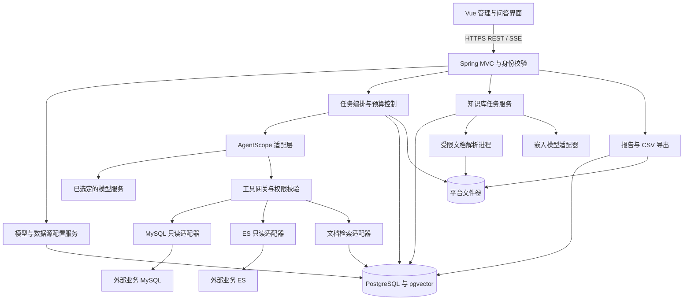
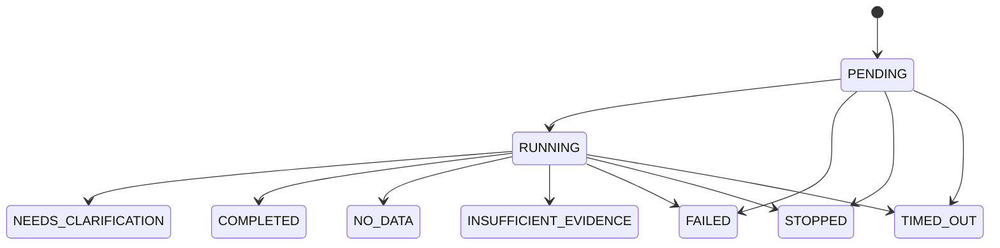

# 智能体问答与数据分析平台技术设计

- 版本：1.2
- 日期：2026-09-23
- 状态：设计完成；基础依赖与关键协议验证通过，真实模型和 PostgreSQL + pgvector 待补测，详见《技术验证报告》
- 需求基准：[已审核 PRD v1.0](./PRD.md)
- 适用范围：第一版 MVP

## 1. 设计结论与约束

采用前后端分离的模块化单体：Vue 3 管理界面、Spring Boot 后端、AgentScope Java 智能体执行适配层、PostgreSQL 平台存储与 pgvector 文档向量检索、本地持久化文件目录。通过 REST 提交操作，通过 SSE 推送任务进度。

第一版部署一个后端实例，最多运行 5 个问答任务。文档解析运行在受限的独立进程中，由后端持久化任务调度。不引入微服务、消息中间件或多智能体编排。

平台数据库与用户接入的数据源分开：PostgreSQL 保存平台账号、配置、会话与知识库；外部 MySQL 和 Elasticsearch 只作为受控查询目标。选用 PostgreSQL 是为了将事务数据与文档向量放在同一存储中，不改变 PRD 中支持 MySQL 数据源的要求。

以下规则不可被技术实现绕过：

1. 一个会话绑定一个模型和一个数据源，首次提问后不可切换身份。
2. 模型只能调用当前数据源对应的受控工具，不能决定连接地址、账号或授权范围。
3. 数据库和 ES 查询只读；实际执行结果是证据来源。
4. 执行记录、最终答案和导出使用同一次任务快照。
5. 无数据、证据不足、失败与成功分别处理。
6. 不增加 PRD 未要求的逐次人工查询审批流程。

## 2. 技术选型与版本策略

### 2.1 后端与框架

- **Java 21、Maven 3.9 系列：**作为工程基线，使用 Maven Wrapper 固定实际工具版本。
- **Spring Boot 3.5.16：**作为首轮兼容性验证候选；Spring MVC 提供 REST 与 SSE，Spring Security 提供账号认证、授权和 CSRF 防护。官方 3.5 文档列出的 Java 范围包含 Java 21。[系统要求](https://docs.spring.io/spring-boot/3.5/system-requirements.html)
- **AgentScope Java 2.0.1：**作为首轮验证候选。官方仓库示例使用此版本，模型提供方已拆分为独立扩展。[官方仓库](https://github.com/agentscope-ai/agentscope-java)
- **Spring JDBC / JdbcClient、Flyway：**负责平台数据访问与数据库迁移；外部 MySQL 使用独立 JDBC 连接管理，不能复用平台数据源。
- **JSqlParser 5.x：**解析 SQL AST；安全策略由本项目实现，不能把“能够解析”视为“安全”。[官方用法](https://jsqlparser.github.io/JSqlParser/usage.html)
- **Apache PDFBox 3.x、Apache POI 5.x：**分别解析 PDF 和 DOCX，定位信息由本项目保存。[PDFBox 文档](https://pdfbox.apache.org/3.0/migration.html)、[POI XWPF 文档](https://poi.apache.org/components/document/quick-guide-xwpf.html)

AgentScope 初始直接依赖 `agentscope-core`、`agentscope-extensions-model-openai`、`agentscope-extensions-model-ollama`，三个模块使用同一版本；采用 `ReActAgent`，不启用工作区、自主文件执行或子智能体工具。官方文档提供 Agent、Toolkit 和事件流接口；动态配置通过项目适配层显式创建模型。[Agent 文档](https://java.agentscope.io/v2/en/docs/building-blocks/agent)、[模型文档](https://java.agentscope.io/v2/en/docs/building-blocks/model)

上述官方页面可能持续更新。精确类名、取消接口、结构化输出和模型 builder 参数必须用固定版本编译验证，不能将当前文档示例当成已验证的 2.0.1 API。

### 2.2 前端

采用 Vue 3、TypeScript、Vite、Vue Router、Pinia、Element Plus。用一个 API 客户端统一处理认证失效、CSRF、错误码和任务状态；Markdown 渲染关闭原始 HTML，并对链接做协议检查。[Vue 文档](https://vuejs.org/guide/introduction.html)、[Vite 文档](https://vite.dev/guide/)

前端按认证、问答、模型、数据源、知识库、账号六个业务域组织。Node.js 主版本及前端包的精确版本在工程初始化时根据实际 Vite 要求锁定到 `.node-version` 和 `package-lock.json`，CI 使用 `npm ci`。

### 2.3 存储与部署基线

- 平台数据库候选为 PostgreSQL 17，向量扩展候选为 pgvector 0.8.6；原生部署准备时固定补丁版本和安装包校验信息，已有服务记录实际版本。
- 原始文档、结果快照和报告保存在平台专属持久化目录，通过 `BlobStore` 接口访问；不直接向浏览器公开目录。
- 开发及生产均不依赖 Docker：前端构建为静态文件，后端以 Java 21 运行可执行 JAR，由操作系统服务管理；反向代理和平台数据库使用已有服务或本机原生安装。模型、业务 MySQL 和业务 ES 通过配置连接，优先复用用户提供的测试服务。此项依据用户在验证阶段的明确要求调整。
- 外部 MySQL 已用 8.0.42 完成基础只读连接验证；ES 已用 9.0.2 完成两个指定索引的 mapping、限量搜索、日期过滤和 terms 聚合验证。其他版本及更完整查询语法仍按版本适配和测试，不据此宣布支持全部版本。
- ES 采用受限 HTTP JSON 适配器，避免把外部集群的所有管理 API 暴露给模型。不同版本的请求响应差异在适配器内部处理。

所有候选版本均须经过依赖解析、编译、最小集成测试和依赖风险检查后冻结到 `pom.xml`、锁文件及部署配置；原生安装包保存版本、来源和校验信息。禁止使用 `LATEST` 或版本区间。第一版验证完成前不自动升级 Spring Boot 或 AgentScope 大版本。

## 3. 总体架构与模块边界



### 3.1 模块职责

- `identity`：登录、账号、角色、密码策略、会话归属校验。
- `configuration`：模型及数据源版本、测试记录、发布状态、密钥引用。
- `conversation`：会话、消息、已确认条件、首问锁定和删除。
- `execution`：任务状态机、准入、幂等、预算、停止、超时和重启清理。
- `agent`：将平台配置和消息转换为 AgentScope 调用，隔离框架类型。
- `toolgateway`：执行前统一授权、计数、校验、审计和结果标准化。
- `connector.mysql` / `connector.elasticsearch`：查询校验、执行、资源回收及元数据读取。
- `knowledge`：文档版本、解析、分段、向量化、索引代次和引用。
- `evidence`：证据快照、数值事实、引用与答案校验。
- `export`：按快照生成报告、CSV 和鉴权下载。
- `storage` / `observability`：文件持久化、清理、日志及指标。

模块通过应用服务和 DTO 调用。AgentScope 类型仅出现在 `agent` 模块；工具适配器不能直接操作前端事件；Controller 不能自行执行 SQL。

### 3.2 计划目录

```text
backend/
  pom.xml
  src/main/java/.../platform/
    identity/ configuration/ conversation/ execution/
    agent/ toolgateway/ connector/ knowledge/ evidence/ export/
    storage/ observability/
  src/main/resources/db/migration/
  src/test/
frontend/
  src/modules/ src/api/ src/components/
deploy/
  scripts/              # 原生安装与服务启停脚本
  service/              # 按目标操作系统配置服务
  config/
docs/
  PRD.md
  技术设计.md
  技术验证报告.md       # 验证执行后创建
  开发任务清单.md       # 任务拆分时创建
```

目录为待建工程设计，本次不生成应用代码或占位验证报告。

## 4. 问答执行设计

### 4.1 受理、幂等与准入

`POST /api/v1/conversations/{id}/runs` 接收 `clientRequestId` 和 `question`。当前用户身份从登录态取得，不能由请求体指定。

受理流程：检查账号和归属 → 查询幂等记录 → 校验会话与配置状态 → 锁定会话行 → 非阻塞获取全局运行名额 → 在事务中写入用户消息、配置快照、任务与首个事件 → 提交后交给任务执行器。

- `(owner_id, client_request_id)` 唯一；相同请求和内容返回原任务，不重新执行；相同键不同内容返回 `409 IDEMPOTENCY_CONFLICT`。
- 单会话通过数据库部分唯一索引约束只能有一个未结束执行记录，不能仅靠页面禁用按钮。
- 全局名额使用单实例内的 5 个许可，无名额返回 `429 RUN_CAPACITY_EXCEEDED`，不创建新的用户消息或排队任务。
- 事务失败、唯一键冲突或执行器提交失败均释放刚获取的许可。执行器提交失败时将已落库任务标为失败。
- 启动时获取 PostgreSQL 单实例运行锁，第二个后端实例不能接受任务；意外失去该连接时停止准入并终止本实例任务。首版不能通过多起一个进程突破全局上限。
- 请求必须在 2 秒内返回 `202` 与任务 ID，或明确错误；外部模型和数据源调用不得发生在受理事务里。受理阶段数据库锁等待及事务设短超时，剩余响应预算不足时返回明确的繁忙错误，不能无限等锁。

### 4.2 任务状态机



`NEEDS_CLARIFICATION` 是本次任务的终态，释放运行名额；用户补充信息后创建新任务，以 `parent_run_id` 关联原任务。会话继续保留同一个模型和数据源，不能将澄清任务长时间占用线程。

增加内部字段 `cancel_requested_at`、`execution_released_at` 和 `deadline_at`：取消处理中不是新的产品终态；`execution_released_at` 用来区分答案已结束与底层资源确实释放。任务终态采用带版本号的条件更新，只能写入一次。

终态判定遵循：已验证的回答为 COMPLETED；查询成功但没有匹配明细为 NO_DATA；有部分证据但不足以回答为 INSUFFICIENT_EVIDENCE；查询或模型错误且无法形成可用证据摘要为 FAILED。聚合返回 `COUNT=0` 是有效统计结论，可为 COMPLETED，不能与空结果混同。文档检索未找到支持片段归为证据不足。

所有新外部调用前均检查取消标记、截止时间和预算。停止时中断 AgentScope 调用，取消 HTTP 订阅与 JDBC Statement，关闭不能确认可回收的连接。模型结束、停止和超时竞争时，以先成功提交的终态为准；迟到结果不得覆盖终态。

底层取消未完成时展示“取消处理中”，仍占用运行许可；到达整体截止时间后可以标记终态，但实际许可必须在执行资源释放后再归还，避免反复停止制造无限后台请求。资源长时间无法释放时告警并阻止继续扩容任务。

重启取得实例锁后，将前一实例遗留的 PENDING / RUNNING 标为 `FAILED / SERVER_RESTARTED`，释放其会话占用，不自动重跑。已完成的结果不受影响。

### 4.3 编排步骤

1. 固定模型版本、数据源版本、指标口径、时区、知识库代次、提示词版本、运行限制和用户问题。
2. 读取已确认条件与必要历史，解析相对日期，并形成明确的日期起止值。
3. 生成结构化任务意图，包含指标、维度、筛选、时间范围、缺失条件；缺少关键业务信息时生成澄清问题并结束当前任务。
4. 为选定数据源创建专用 Toolkit，只注册 `query_mysql`、`search_es`、`search_documents` 中对应的一个查询工具。辅助的澄清或结果提交方法不能访问外部数据。
5. 工具网关检验权限及查询，按预算执行，将结果和证据落盘落库，再把带证据 ID 的摘要提供给模型。
6. 模型生成带证据引用的结构化回答草稿；平台校验引用、关键数值和状态，将通过的内容渲染为最终答案。
7. 在事务中保存答案、证据关联、导出资格和终态事件，释放会话执行锁与运行资源。

不能直接把自由 ReAct 的任意文本当最终答案。工具只返回当前任务的证据，模型无工具证据时不能进入 `COMPLETED`。错误修正不更换模型，不调用其他数据源。

### 4.4 预算与上下文

问答整体 180 秒，自受理事务提交的时间起计；模型调用上限 120 秒；数据查询上限 30 秒，实际调用上限取配置值和剩余整体时间的较小值。上下文构建、校验、文件写入和答案保存也计入整体预算。

工具调用最多 5 次，失败修正最多 2 次。为防止连续生成非法查询，每次进入查询工具网关即扣减一次尝试预算，包含被校验拒绝的尝试；元数据由配置快照提供，不允许模型绕过工具预算任意读取。

AgentScope 的迭代次数是额外保险，不能替代独立的查询计数。每轮工具串行执行，关闭自动模型回退，显式配置 SDK 重试；首版不自动重试已发出的业务查询，避免隐式超出次数。模型传输失败默认直接结束，后续若增加重试须统一纳入时间与调用记录。

预留答案生成时间，默认剩余 20 秒后不再启动新的数据查询。查询次数耗尽但已有证据时优先生成有边界的回答；来不及调用模型时使用确定性模板输出证据摘要并标为证据不足。达到整体截止时间则为超时，不允许继续生成完整报告。

上下文按模型配置的窗口分配：默认输入预算 12,000 tokens、输出预留 2,000 tokens，必须缩减到实际模型允许范围。保存完整历史，但调用仅携带已确认条件、最近相关消息和当前证据；旧条件不依赖模型生成的摘要作为唯一依据。超出预算时减少历史和证据样本并标记限制，不截断计算口径。token 估算器不适用时采用保守估算并通过模型联调校准。

## 5. AgentScope 与模型配置

### 5.1 适配层契约

项目定义 `AgentRunner`、`ChatModelFactory`、`EmbeddingClient` 三个接口。下列为项目内部契约描述，不是承诺框架存在同名 API：

```text
AgentRunner.execute(RunContext, ConfirmedIntent, EvidenceSink) -> RunHandle
RunHandle.cancel() -> cancellation request
ChatModelFactory.create(ModelVersion, SecretHandle) -> provider model
EmbeddingClient.embed(EmbeddingVersion, texts, deadline) -> vectors + usage
```

每次任务创建独立的 `ReActAgent` 实例和隔离运行上下文，任务结束后释放实例。2.0.1 发布源码的线程安全注释与实际并发行为存在差异，实测不同会话可同时发出模型请求；平台不能依赖该注释所称的异常拒绝机制，必须自行实现准入和会话互斥。模型客户端如需缓存，以配置版本和密钥版本标识作为键，不以模型名称作为唯一键。凭证只由密钥服务在调用边界解密，禁止放进 system prompt、RuntimeContext 的可日志化元数据及事件。

平台自行保存对话消息与结果，任务按需重建 AgentScope 上下文；不同时启用两套独立的自动会话持久化，避免历史重复和终态不一致。PRD 所需的重启历史恢复来自平台数据库，不依赖智能体继续运行。

### 5.2 配置版本与启用

模型、连接、授权结构、指标口径及嵌入配置采用不可变版本记录。编辑创建新草稿，`publish/enable` 原子切换生效版本。

模型修改地址、模型标识或密钥后，新版本测试状态清空并暂停该模型的新问答准入，重新测试并满足质量门槛后再启用；已受理任务保留原版本。会话固定模型和数据源 ID，但后续任务读取该 ID 当前生效版本，并在界面提示版本变化，符合 PRD 的“配置变更影响后续任务”。数据源目标数据库或索引身份变化必须新建数据源，不允许借编辑将旧会话换到另一个业务源。

测试使用固定样例，分别保存连接、基础对话、工具调用及流式响应结果。工具调用测试必须实际触发无副作用的测试工具、返回结果并得到响应；不能只检查模型自称支持。非流式模型仍通过平台事件展示执行阶段。

生产启用还要求关联通过的模型业务评测记录及数据发送确认记录。启用条件由后端校验，不能只由前端按钮控制；开发环境的试运行不等于已向普通用户发布。

### 5.3 事件转换

AgentScope 文档区分文本、工具调用、工具结果、模型调用等事件。本项目只将经过筛选的实际执行事件转成自己的稳定事件协议；工具开始不等于成功，工具结果明确成功后才能记录成功。[事件文档](https://java.agentscope.io/v2/en/docs/building-blocks/message-and-event)

不透传内部 thinking 事件、密钥、原始工具错误堆栈。模型的计划说明只能标记为计划，不能伪装为已执行步骤。只对最终回答阶段的文本开放草稿流；自由循环中的中间文本不直接当作结论推给用户。

## 6. MySQL 查询设计

### 6.1 元数据与业务语义

管理员授权后读取表、列、类型、主外键，保存结构快照与结构 hash。元数据读取使用专用固定 SQL，和用户问答查询分开。表与字段说明、指标公式、关联关系、时区一起形成发布版本。

指标公式采用可解析的结构或表达式，并记录依赖字段；不允许保存后直接拼接未经验证的任意 SQL。模型只看到授权结构及必要业务说明；结构变化后，失效字段报错并要求管理员刷新，不静默猜测替代字段。

### 6.2 SQL 安全网关

模型输出参数化查询结构：SQL、绑定参数、指标及口径引用。网关逐层执行：

1. 限制输入长度，解析为单条 SELECT；解析失败或不支持的 AST 节点默认拒绝。
2. 遍历全部子查询、CTE、UNION 分支和表达式，解析别名、CTE 作用域、数据库、表和列引用；所有物理对象必须属于授权集合。
3. 允许必要的聚合、筛选、排序和已配置关系的连接；禁止递归 CTE、锁定读取、变量赋值、SELECT INTO、文件访问、过程调用、未知 UDF、SLEEP / BENCHMARK 等函数。MySQL 特殊执行注释和未经平台生成的 hint 默认拒绝。
4. 函数使用白名单；未知函数拒绝。参数值使用 JDBC 绑定，标识符从校验后的 AST 生成，不能用字符串替换完成转义。
5. 给完整查询的最终结果施加读取上限，最多读取 1,001 行判断是否超过 1,000 行；保留前 1,000 行和 `truncated=true`。若用户要求更小的 LIMIT 则保留其语义。不能在聚合输入前插入 LIMIT。
6. 通过独立只读账号执行，使用数据库执行时限、JDBC query timeout、网络超时和取消句柄共同限制资源。

JSqlParser 仅负责语法结构；授权和副作用判断由项目策略完成。校验通过不代表数据库权限可以省略。授权视图如使用 definer 权限，其输出范围必须由管理员审核；不得由模型创建或扩展视图。

MySQL `max_execution_time` 只在其支持的只读 SELECT 范围内生效，不能当作通用取消机制；实际取消行为必须对候选 JDBC 驱动验证。[MySQL 官方说明](https://dev.mysql.com/doc/refman/8.4/en/server-system-variables.html#sysvar_max_execution_time)

### 6.3 连接与结果

连接池按数据源版本区分，默认每个活跃数据源最多 2 个连接，设全局业务连接上限和空闲池回收。账号不得持有 DML、DDL、FILE 或执行存储程序的权限。禁用多语句与本地文件导入选项，不接受用户提交任意 JDBC 参数。

结果保存列名、类型、单位、行数、截断标志、实际 SQL 及参数、耗时和数据库返回错误分类。DECIMAL 使用十进制精度，传给浏览器时避免 JavaScript 精度损失；时间保存原始值、类型及解释时区。SQL NULL、空字符串与 0 在 JSON 和页面中分别表示。

聚合数值以数据库结果为准；派生比例由受限 `BigDecimal` 计算器依据证据单元格计算，记录公式及舍入规则，不能执行模型提供的脚本。零分母显示无法计算。

## 7. Elasticsearch 查询设计

### 7.1 目标与字段校验

发布时解析具体索引名和索引 UUID，拒绝通配符、多索引别名及数据流目标；可解析的单索引别名固定到实际索引身份。运行前校验目标身份；同名索引被替换时阻止查询并要求刷新。

管理员客户端可读取已配置索引所需的 mapping；问答客户端只能调用固定目标的 `_search`。HTTP 路径由平台构造，模型只提供待验证的 JSON 查询体，不能指定方法、地址、路径或 headers。

### 7.2 DSL 白名单

首版支持 `bool`、`term/terms`、`match/multi_match`、`range`、`exists`、受控 `match_all`，以及 `terms`、`date_histogram`、`filter`、`sum/avg/min/max/value_count/cardinality` 聚合；按实际样例补充经过测试的节点。

递归验证字段类型、字段用途、嵌套深度、布尔子句数量、数组长度和聚合预算；未知节点拒绝。禁止 scripts、runtime mappings、写操作、跨索引 terms lookup 和任意管理 API。排序和 `_source` 字段由配置范围限制。字段允许聚合还必须同时满足 mapping 类型与 `doc_values` 可用；实测 ES 9.0.2 中存在 `keyword` 但显式禁用 `doc_values` 的字段，对其执行 terms 聚合会返回 400，因此不能仅凭字段类型开放聚合。

结果明细最多保留 1,000 条，预览 100 条；聚合返回的所有层级桶合计最多 100 个。生成前估算并约束桶数，响应后再次检查；超限时说明限制，不能把部分结果当全量。首版不使用无限 scroll 拉全量。

### 7.3 结果语义

保留 `hits.total.value/relation`、`timed_out`、分片失败信息及聚合误差。`cardinality` 标为近似去重计数；`terms` 保留 `sum_other_doc_count` 和可获得的误差界，不能宣称所有桶均已覆盖。[Terms 聚合说明](https://www.elastic.co/docs/reference/aggregations/search-aggregations-bucket-terms-aggregation)

设置查询超时和 HTTP 截止时间；发生分片失败或超时返回部分结果时，若有证据则为证据不足，否则失败。用户停止后关闭请求并阻止新查询，客户端取消不保证集群计算立即停止，仍依靠服务端超时限制。

## 8. 文档解析、版本与向量检索

### 8.1 上传与解析

上传时验证大小、内容格式及 SHA-256；文件名仅作为显示字段，物理存储使用服务端生成的 ID，禁止相对路径和用户路径拼接。文件先写临时区并校验，再原子移动到正式文件区，数据库提交引用。中途失败的孤立文件由清理任务回收。

PDFBox 按页提取文本；DOCX 按正文段落、标题及表格单元格的文档顺序提取；TXT 识别 UTF-8 / BOM 编码，无法可靠识别时明确失败并提示转换编码。定位保存为源片段元数据，不根据模型回答反推位置。

初始分段目标为 800 个 Unicode 字符、相邻段重叠最多 120 字符，优先沿标题、段落和句子边界切分。PDF 不跨页；DOCX 保存标题路径、段落范围及必要表格坐标；TXT 保存行号范围。实际送入嵌入服务前还必须按该模型 token 上限再次拆分。

解析在无业务凭证、无网络的独立进程中执行，限制 CPU、内存、临时目录和时间；DOCX 解压检查条目数、解压总量和压缩比，不解析外部资源。工程初始解析时限 120 秒、进程内存上限 512 MiB，作为待样例验证的资源保护值；超限明确失败，不产生“可检索”状态。20 MB 和 100 个有效文档沿用 PRD。

### 8.2 索引代次与原子发布

知识库使用 `active_generation_id`，每个代次绑定一个嵌入配置版本、维度、分段器版本和文档版本清单。查询任务受理时固定代次，整个任务都使用该代次的嵌入配置。

- 新上传或文档新版本先解析、向量化，在完整清单准备好后原子发布新代次。新版本失败时旧版本仍可查询。
- 相同知识库内相同内容 hash 不重复处理；同名不同内容要求管理员明确选择更新，避免隐式覆盖。
- 更换嵌入模型时为全部有效文档构建新代次，维度和模型版本不能混用。建设期间旧代次继续服务，若旧嵌入服务不可用则提示查询失败，不能偷偷切到新模型。
- 同一知识库仅一个索引构建任务在运行。构建记录目录修订号，发布时比较修订号；文档变更使修订号过期时重新生成清单并补齐向量，不能发布遗漏新增或包含已移除文档的旧清单。
- 文档移除事务立即写入移除修订号；之后受理的任务固定排除该文档的有效清单。已运行任务可继续使用其受理时快照，历史引用保留片段并提示来源已移除。
- 旧代次没有运行任务引用后可异步清理向量；历史证据已独立保存，不依赖旧向量存在。

知识库无可检索文档时禁止新问答。有部分文档处理失败或仍在处理时，回答附带此次实际参与的文档范围说明。

### 8.3 检索与嵌入

`EmbeddingClient` 分别适配 OpenAI 与 Ollama 的经验证嵌入接口；独立于聊天模型。探测保存向量维度、归一化规则、输入上限和服务指纹。嵌入结果必须为有限非零向量，同一代次维度一致；返回数量与输入数量不一致时整个批次失败。

初版使用 pgvector 精确余弦距离检索，先限制到固定代次及有效文档清单，再排序取最多 8 个片段。使用无固定维度的向量列配合代次维度校验，以支持不同知识库的模型维度；查询 SQL 必须先隔离代次再计算距离。pgvector 官方提供精确检索和余弦距离能力。[pgvector 文档](https://github.com/pgvector/pgvector)

不默认创建 HNSW 索引，不把某个向量模型维度假定为通用值。若精确检索在实际规模不达标，再根据维度和知识库分区验证 ANN 方案，并记录召回变化。向量类型容量及索引维度限制分别检查，不能混为一谈。

检索分数不等于答案可信度。每个嵌入模型的相关性阈值通过固定问答集校准并随配置保存；低相关片段不强行拼出答案。超过上下文预算时保留最相关证据和出处，明确未覆盖全部文档。第一版不增加重排序服务。

### 8.4 后台任务

文档任务状态为 QUEUED / RUNNING / SUCCEEDED / FAILED / CANCELLED，与文档可检索状态分开。PostgreSQL 任务表保存尝试次数、租约及检查点，由独立有界执行器处理，默认文档构建并发 1。

嵌入请求如发生可重试的暂时错误，最多 2 次延迟重试，记录每次尝试和费用用量；不适用问答的 5 次查询预算。检查点以内容 hash、嵌入版本和分段器版本去重；失败任务可以人工重试。进程崩溃后可从已完成分段恢复，但不得把半成品代次发布为有效。

## 9. 证据、回答与事件协议

### 9.1 统一工具结果

三种工具均返回下列平台结构，字段名在接口实现时保持一致：

```json
{
  "stepId": "uuid",
  "evidenceId": "uuid",
  "sourceType": "MYSQL",
  "status": "SUCCESS",
  "schema": [{"name": "amount", "type": "DECIMAL", "unit": "CNY"}],
  "previewRows": [["12345.67"]],
  "resultSetId": "uuid",
  "retainedRowCount": 1,
  "totalCount": null,
  "truncated": false,
  "approximate": false,
  "warnings": [],
  "durationMs": 128
}
```

`totalCount=null` 表示未知，不使用保留行数伪装总行数。文档证据以 `chunks` 代替行结构，携带文档版本、定位、片段及检索分数。完整结果保存为独立快照，送给模型的是受上下文限制的预览及可引用事实。

每个证据必须关联任务、实际执行步骤、数据源版本和内容 hash。SQL/DSL 保存已实际执行的规范化版本，拒绝执行的查询单独标注为 DENIED，不能生成成功证据。

### 9.2 回答校验

回答内部结构包含 `status`、`summary`、`findings`、`citations`、`confirmedConditions`、`limitations` 和 `usedResultSetIds`。结论所引 ID 必须属于当前任务；如需承接上一轮证据，先创建显式继承记录并标注原查询时间，涉及最新数据时重新查询。

结构化数据的关键数值采用事实引用或受限计算引用，后台填入实际值再渲染。文本结论的事实一致性通过固定样例评测和有限一致性校验评估，不能宣称程序可以证明所有自然语言结论正确。

回答结构不合法时，在整体时间预算内最多做一次格式修复，不能再查询数据。仍不合法或出现无法核实的关键事实时，使用已保存证据生成受限摘要并标为证据不足；完全没有可用证据且执行失败则为失败。

最终答案是平台校验后的对象。前端收到的文本 delta 标记为“生成中”，直到 `answer.finalized` 替换成最终内容；未经校验的草稿不能下载。

### 9.3 SSE 协议

接口：`GET /api/v1/runs/{runId}/events`，同源 Cookie 认证。支持 `Last-Event-ID`，首次从历史打开时也可传 `afterSeq`。优先采用有效的 Last-Event-ID；不能使用 URL 中的凭证。

平台事件类型：`run.accepted`、`run.started`、`step.started`、`step.completed`、`step.failed`、`answer.delta`、`answer.finalized`、`run.finished`。澄清通过 `answer.finalized` 加 `NEEDS_CLARIFICATION` 表示。

```text
id: 18
event: step.completed
data: {"runId":"uuid","seq":18,"stepId":"uuid","occurredAt":"2026-09-23T08:00:00Z","payload":{"kind":"MYSQL_QUERY","evidenceId":"uuid"}}
```

每个任务单调递增序号，`(run_id, seq)` 唯一。业务步骤和事件在同一数据库事务提交，SSE 只发送已提交记录；文本增量按短时间窗口合并后落库，降低写入量。框架事件 ID 与平台 seq 分开保存，用于关联与排障。

事件表同时充当可重放日志：数据库游标查询为事实源，进程内通知只负责唤醒；即使通知丢失也能补读，避免“先读历史再订阅”的空窗。传输采用至少一次语义，前端按 seq 去重，不承诺网络层恰好一次。

15 秒发送一次无业务含义的 heartbeat，不占业务 seq。代理关闭 SSE 缓冲，读取超时大于心跳间隔。终态事件发送后关闭连接；重连先补齐，再关闭。浏览器断线不停止任务，显式停止接口才触发取消。

连接建立和事件发送时都检查会话归属及账号有效性；账号停用、会话删除时关闭关联 SSE。不要仅在建立长连接时检查一次权限。

## 10. 数据模型与事务设计

### 10.1 通用约定

平台使用 UUID 主键、UTC `timestamptz` 时间、UTF-8 文本；金额等业务精度值保留十进制。可变配置 JSON 使用 `jsonb`，关系、状态、唯一性和查询条件使用明确列，不把全部数据塞进一个 JSON。

可修改实体带 `revision` 用于乐观锁；不可变配置版本和证据不覆盖更新。以下字段为建表基线，审计时间等通用字段省略，完整 DDL 在 Flyway 迁移中实现。

### 10.2 账号与配置

- `app_user`：`id, username, password_hash, role, enabled, auth_version, must_change_password`。用户名归一化后唯一，角色为 ADMIN / USER。
- `login_session`：由 Spring Session JDBC 管理；与账号停用、密码重置及退出联动失效。
- `secret_version`：`id, key_id, ciphertext, nonce, secret_kind, created_by`。只保存密文，不提供读取明文的业务接口。
- `model_config`：`id, display_name, enabled, active_version_id, revision`。
- `model_version`：`id, model_id, version_no, provider, endpoint, model_name, secret_version_id, timeout_ms, context_limit, stream_mode, config_hash`。`(model_id, version_no)` 唯一。
- `model_test`：`id, model_version_id, test_kind, result, detail_redacted, tested_at`。
- `model_evaluation`：`id, model_version_id, dataset_version, total_cases, passed_cases, category_scores, critical_cases_passed, report_blob_id, confirmed_by`。
- `embedding_config / embedding_version`：独立配置身份与版本；包含提供方、地址、模型标识、密钥引用、维度、输入上限、检测状态和指纹。
- `data_source`：`id, name, type, enabled, active_version_id, revision`。类型 MYSQL / ELASTICSEARCH / KNOWLEDGE_BASE。
- `data_source_version`：`id, source_id, version_no, connection_json, secret_version_id, timezone, schema_hash, schema_json, allowed_objects_json, knowledge_base_id`。按类型校验字段，知识库类型不保存外部查询凭证。
- `business_metric`：`id, source_version_id, name, expression_json, time_field, filters_json, unit, rounding_rule`。
- `publication_record`：关联配置版本、发布人、发布时间、数据发送确认和适用说明，避免把测试通过当作发布授权。

### 10.3 知识库与文件

- `knowledge_base`：`id, name, active_generation_id, catalog_revision, pending_embedding_version_id`。
- `document`：`id, kb_id, normalized_name, removed_at, removed_revision`；同一库内有效名称唯一。
- `document_version`：`id, document_id, version_no, content_hash, blob_id, parse_status, failure_code, parser_version`。
- `document_chunk`：`id, document_version_id, ordinal, text, location_json, chunk_hash, splitter_version`；定位保留页码或段落、行号范围。
- `kb_generation`：`id, kb_id, embedding_version_id, dimensions, manifest_revision, status, published_at`。
- `generation_document`：`generation_id, document_id, document_version_id`，复合主键约束每代次每文档一个版本。
- `chunk_embedding`：`generation_id, chunk_id, dimensions, embedding vector`；复合主键防止重复，写入时校验与代次维度一致。
- `document_job`：`id, kb_id, document_version_id, generation_id, kind, status, attempt, next_attempt_at, lease_until, checkpoint_json, error_code`。
- `blob_object`：`id, storage_key, sha256, size_bytes, media_type, state`。storage_key 由平台生成，不存用户可控绝对路径。

相同内容的复用通过 hash 查询完成，但不同知识库之间不能通过接口泄露文件是否已存在。原始文档、片段和向量的生命周期分开管理。

### 10.4 会话、任务与证据

- `conversation`：`id, owner_id, model_id, source_id, title, locked_at, confirmed_conditions_json, deleted_at, revision`。
- `message`：`id, conversation_id, run_id, role, content_json, created_at`。
- `qa_run`：`id, conversation_id, owner_id, client_request_id, request_hash, parent_run_id, state, config_snapshot_json, started_at, deadline_at, cancel_requested_at, finished_at, execution_released_at, error_code, revision`。
- `execution_step`：`id, run_id, ordinal, kind, state, framework_tool_call_id, input_redacted_json, started_at, finished_at, error_code`。
- `run_event`：`run_id, seq, event_type, payload_json, created_at`，复合主键。
- `evidence`：`id, run_id, step_id, source_version_id, kind, snapshot_json, content_hash, source_status`。
- `result_set`：`id, run_id, evidence_id, schema_json, blob_id, retained_row_count, total_count, truncated, approximate, warnings_json`。
- `answer`：`run_id, state, content_json, markdown, used_result_set_ids, renderer_version`，每任务最多一个最终答案。
- `export_artifact`：`id, run_id, owner_id, kind, result_set_id, blob_id, state, renderer_version`。
- `audit_log`：`id, actor_id, action, target_type, target_id, result, occurred_at`，不写密钥、全文问题和完整结果。
- `cleanup_job`：`id, target_type, target_id, status, retry_count, next_attempt_at`，确保删除和文件回收可重试。

主要索引：会话 `(owner_id, updated_at)`；消息 `(conversation_id, created_at, id)`；任务 `(owner_id, client_request_id)` 唯一；步骤 `(run_id, ordinal)` 唯一；任务状态与截止时间索引；待处理文档任务 `(status, next_attempt_at)`；知识库代次与文档版本查询索引。

### 10.5 关键数据库约束示意

```sql
CREATE UNIQUE INDEX uq_run_request
    ON qa_run(owner_id, client_request_id);

CREATE UNIQUE INDEX uq_conversation_executing
    ON qa_run(conversation_id)
    WHERE execution_released_at IS NULL;

CREATE UNIQUE INDEX uq_generation_chunk
    ON chunk_embedding(generation_id, chunk_id);
```

以上为设计示意，不是完整迁移脚本。任务创建即占执行槽，所有结束路径在资源回收后设置 `execution_released_at`；状态已终止但资源未释放期间仍拒绝同会话新任务。启动清理在允许准入前完成。

### 10.6 文件与数据库一致性

采用“临时文件 → 完整写入及 hash → 原子重命名 → 数据库引用”的顺序，先有可读文件再发布结果。数据库事务失败留下的孤立文件可回收；数据库不可引用尚未写完的文件。

结果快照默认每结果集上限 20 MiB、单字段文本上限 64 KiB，作为资源保护配置；超过时保留可保存内容并明确标记字节级截断，不能以行数未满暗示数据完整。影响问题所需证据时判为证据不足。

会话删除先设置 tombstone、拒绝所有读取并请求取消运行，资源释放后清理消息、任务、证据和导出引用。文件清理失败由 `cleanup_job` 重试；删除前已开始的导出写入也要在发布前检查 tombstone。备份不在实时删除范围内。

## 11. REST 接口设计

统一前缀 `/api/v1`，时间采用 ISO 8601 UTC，列表使用游标分页。配置更新带 `If-Match` 或 `revision`，冲突返回 409。普通用户只获得启用配置的精简选项，不获得连接详情。

### 11.1 认证与账号

- `GET /auth/csrf`：获取 CSRF token。
- `POST /auth/login`、`POST /auth/logout`、`GET /auth/me`。
- `POST /auth/change-password`：当前用户修改密码。
- `GET/POST /admin/users`：管理员列出或创建账号。
- `PATCH /admin/users/{id}`：启停账号；`POST /admin/users/{id}/reset-password`：重置并强制改密。

### 11.2 模型与数据源

- `GET /options/models`、`GET /options/data-sources`：问答可选项。
- `GET/POST /admin/models`、`GET/PATCH /admin/models/{id}`。
- `POST /admin/models/{id}/tests`：测试指定草稿版本，异步返回测试任务 ID。
- `POST /admin/models/{id}/evaluations`：登记关联可核查报告的业务评测结果。
- `POST /admin/models/{id}/enable`、`POST /admin/models/{id}/disable`。
- `GET/POST /admin/data-sources`、`GET/PATCH /admin/data-sources/{id}`。
- `POST /admin/data-sources/{id}/tests`、`POST /admin/data-sources/{id}/schema-refresh`。
- `PUT /admin/data-sources/{id}/semantics`：保存授权结构、说明和指标口径草稿。
- `POST /admin/data-sources/{id}/publish`、`POST /admin/data-sources/{id}/disable`。
- `GET /admin/test-jobs/{id}`：查询模型、连接和嵌入测试进度与脱敏结果。

密钥编辑使用 `KEEP / REPLACE / CLEAR` 明确语义，掩码不能作为新密钥回写。每次配置响应只返回 `hasSecret` 和掩码提示。

### 11.3 知识库

- `GET/POST /admin/embedding-models`、`GET/PATCH /admin/embedding-models/{id}`、`POST /admin/embedding-models/{id}/tests`。
- `GET/POST /admin/knowledge-bases`、`GET/PATCH /admin/knowledge-bases/{id}`。
- `POST /admin/knowledge-bases/{id}/documents`：multipart 上传，202 返回文档和处理任务 ID。
- `GET /admin/knowledge-bases/{id}/documents`：列表与处理状态。
- `POST /admin/documents/{id}/versions`：明确上传新版本。
- `DELETE /admin/documents/{id}`：逻辑移除，不抹去历史证据。
- `POST /admin/document-jobs/{id}/retry`、`GET /admin/document-jobs/{id}`。
- `POST /admin/knowledge-bases/{id}/reindex`：指定经过测试的嵌入版本，构建新代次。
- 知识库发布和停用复用其对应 `data-source` 的发布接口，检查可检索文档和嵌入服务状态。

### 11.4 会话、任务与下载

- `GET/POST /conversations`、`GET/PATCH/DELETE /conversations/{id}`；PATCH 仅允许标题及首问前的选项。
- `GET /conversations/{id}/messages`。
- `POST /conversations/{id}/runs`：提交问题；`GET /runs/{id}`：读取任务快照、步骤、最终答案及最新 seq。
- `POST /runs/{id}/cancel`：幂等取消；终态任务返回当前状态，不重复修改。
- `GET /runs/{id}/events`：SSE。
- `GET /runs/{id}/evidence/{evidenceId}`：来源片段或查询详情，包含来源版本变化提示。
- `GET /runs/{id}/result-sets/{resultSetId}`：分页读取保留结果的预览。
- `POST /runs/{id}/exports`：指定 MARKDOWN 或 CSV 与 resultSetId，从快照幂等生成。
- `GET /exports/{id}`：导出状态；`GET /exports/{id}/download`：鉴权下载。

导出创建以 202 返回，由独立有界执行器生成，超出容量返回明确的繁忙提示；不占用智能问答运行名额。状态为 PENDING / RUNNING / READY / FAILED，服务重启后未完成的导出可从不可变快照幂等重建。

提交示例：

```json
{
  "clientRequestId": "a-client-generated-uuid",
  "question": "按照已配置销售额口径，统计上个月各地区销售额"
}
```

受理示例：

```json
{
  "data": {"runId": "uuid", "state": "PENDING", "eventsUrl": "/api/v1/runs/uuid/events"},
  "requestId": "trace-id"
}
```

错误格式：

```json
{
  "error": {"code": "SOURCE_DISABLED", "message": "当前数据源已停用", "retryable": false},
  "requestId": "trace-id"
}
```

401 表示未登录；403 表示角色不足；不属于当前用户的会话、任务和导出统一返回 404；409 表示版本或任务冲突；422 表示配置、查询或文件不受支持；429 表示运行容量或登录限流；502/504 表示外部服务或超时问题。业务任务已受理后的失败通过任务状态呈现，不把 SSE 的 HTTP 200 当作业务成功。

## 12. 导出与前端设计

### 12.1 导出

Markdown 由确定性模板渲染 `answer + evidence + run snapshot`，包含问题、终态、模型与数据源名称、时间、口径、结论、实际查询摘要、引用和所有截断/近似标记。保存模板版本，不再调用模型或外部数据库。

CSV 从保存的结构化结果生成，多个结果集分别导出。使用 UTF-8 BOM 兼容常用表格软件，按 CSV 规范处理逗号、双引号和换行；字符串经前导空白检查后如可能被当作公式执行则加文本转义。数值列保持数值语义，不能把正常负数当作文本公式处理。

CSV 的 NULL 使用 `\N`，原始字符串中的反斜线加倍；规则和列类型在报告中说明，避免与空字符串混淆。导出文件名由服务端生成并安全编码，使用附件下载 headers，禁止用户指定物理路径。

Markdown 资格仅为 COMPLETED / NO_DATA / INSUFFICIENT_EVIDENCE；CSV 在这些状态且有已保存结果集时可导出。FAILED / STOPPED / TIMED_OUT / NEEDS_CLARIFICATION 不提供分析结果下载。导出键包含任务、格式、结果集与渲染版本，重复请求复用成品。

### 12.2 前端状态

问答页包含会话列表、模型及数据源选项、消息区、步骤时间线、证据抽屉和下载入口。数据库与 ES 详情折叠展示 SQL / DSL；普通用户默认看到步骤名称、耗时、结果概况和业务结论。

首次发问后选项锁定；切换操作引导新建会话。运行期间输入可编辑但发送按钮禁用；停止后按服务端资源释放状态决定何时允许再次发送。刷新先读取任务快照，再从返回 seq 续接事件；前端从服务端状态恢复，不自行猜测任务是否结束。

对话 Markdown 禁止原始 HTML、脚本和危险 URL；来源内容以文本展示。只渲染当前账号数据，退出登录清空 Pinia 和请求缓存，不把密钥或答案存入持久化浏览器存储。

## 13. 安全、凭证与访问控制

### 13.1 登录与权限

使用 Spring Security + Spring Session JDBC 的服务端会话，Cookie 为 HttpOnly、Secure（生产）、SameSite=Lax。前后端通过反向代理同源提供，默认不开启任意跨域。

保留 CSRF 防护，SPA 在登录及状态变更请求中提交 token，登录和退出后刷新 token；不能因使用 JSON 接口就关闭防护。[Spring Security CSRF 文档](https://docs.spring.io/spring-security/reference/servlet/exploits/csrf.html)

密码使用框架支持的自适应哈希，初版选 BCrypt 并校准成本。部署时从一次性密钥文件初始化管理员，禁止固定默认密码；重置密码强制下次改密。账号停用、改密和退出使关联登录态失效。

所有读写会话、任务、结果、证据与导出的服务方法都校验 `owner_id`，ADMIN 不跳过归属检查。新任务前及每次外部调用前检查账号状态，停用账号触发其在途任务取消。

### 13.2 凭证与网络边界

凭证使用 AES-GCM 加密，保存 key ID 和独立随机 nonce；主密钥通过服务账号专属的受限文件提供，不写入数据库、应用安装包或 Git。备份主密钥需与数据备份分开授权保管。旧密钥版本保留到使用它的任务结束，轮换不能破坏在途配置快照。

管理员配置的模型、ES 和 MySQL 地址也必须经过网络策略：只允许 HTTP(S) 模型/ES及明确 MySQL 主机端口，限制目标域名或网段、禁止云元数据地址、拒绝跨目标重定向；DNS 解析与实际连接都校验。内网及本机 Ollama 是合法需求，通过部署白名单明确放行，不能简单禁止全部私网地址。

浏览器不直连模型和数据源，模型工具参数不能携带凭证、任意 URL 或文件路径。SQL 注释、ES 错误及模型 SDK 异常在展示前脱敏。日志默认不记录请求/响应全文。

### 13.3 数据发送与提示注入

对话模型可能接收问题、授权结构、口径、历史条件及证据摘要；嵌入服务会接收文档分段和检索问题。两类服务的外发范围都应在配置发布时记录确认，不能只确认聊天模型而忽略嵌入模型。

数据库内容、文档文本及用户问题无法覆盖系统规则。服务端的工具白名单、固定目标、AST/DSL 校验及账号权限是实际边界；仅写“忽略恶意指令”的提示词不算完成防护。模型产生的路径、SQL 或函数名不能绕过对应验证器。

## 14. 配置、部署与运维

### 14.1 配置层次

部署配置存放于 `application.yml` 模板和 `deploy/config/`，密钥通过环境引用或 secret 文件加载；业务模型、数据源和口径通过管理页面存库并版本化。运行限制由启动配置管理，任务受理时保存快照，不允许普通用户覆盖。

```yaml
platform:
  execution:
    max-concurrent-runs: 5
    run-timeout: 180s
    model-timeout: 120s
    query-timeout: 30s
    max-query-attempts: 5
    max-query-corrections: 2
    answer-reserve: 20s
  results:
    max-rows: 1000
    preview-rows: 100
    es-max-buckets: 100
    max-result-bytes: 20MB
    max-cell-bytes: 64KB
  knowledge:
    max-file-size: 20MB
    max-active-documents: 100
    retrieval-top-k: 8
    chunk-target-chars: 800
    chunk-overlap-chars: 120
    parse-timeout: 120s
    parse-memory: 512MB
    index-concurrency: 1
  storage:
    root: /var/lib/agent-platform
```

上述为本项目拟定义配置名。后端统一配置绑定及启动校验，页面展示生效限制；它们不是 AgentScope 原生配置键。上传大小限制同时配置到代理和 Spring multipart，避免不同层错误不一致。

### 14.2 部署流程

1. 准备服务账号专属的持久化目录、平台数据库、pgvector 扩展和独立迁移账号；应用运行账号不拥有建扩展权限。
2. 配置受限的加密主密钥文件及一次性管理员初始化密钥，配置允许访问的模型和数据源网络范围。
3. 执行数据库迁移，启动后端，完成单实例锁和遗留任务清理后再进入 ready 状态。
4. 反向代理开启 TLS，同源提供界面、REST、SSE；配置上传限制、SSE 无缓冲和超时。
5. 配置并测试模型、只读数据源及嵌入服务，导入业务评测集，通过 PRD 门槛后发布。

开发环境在 Windows 使用独立 Java 21 与 Maven 3.9 工具链，不修改机器上其他项目使用的全局 Java 版本；数据库连接已有服务或独立原生测试实例。生产采用原生单实例进程，由 Windows 服务管理器或 Linux systemd 管理，具体操作系统在部署前确认。文档解析需要使用操作系统服务账号、目录 ACL、资源限制与网络规则实现隔离；Windows 可使用 Job Object，Linux 可使用 systemd/cgroup 限制。普通子进程不等于生产隔离已验收。

### 14.3 备份、恢复与升级

初始部署建议每天做一次数据库和文件卷的一致性备份、保留 7 天；这是运维默认建议，实际 RPO/RTO 需结合使用量验证。未压测前不承诺恢复时长。

首版备份采用维护窗口：停止新任务与上传 → 等待执行结束或取消 → 暂停后台处理和清理 → 备份数据库及文件卷 → 校验清单与 hash → 恢复服务。不能分别在任意时间复制数据库和文件并宣称它们一致。

恢复到隔离环境，恢复对应加密密钥，检查文档和结果文件引用，验证登录、历史查看、导出及文档检索。恢复演练是上线检查项。升级前备份；数据库迁移不可逆时不直接回退旧应用，按已验证的备份恢复流程处理。

### 14.4 监控与容量

记录运行中任务数、受理时延、模型调用时延、查询时延、步骤失败率、停止到资源释放时延、SSE 重连数、索引任务积压、文件使用量和可获得的 token 用量。指标标签不包含用户名、全文问题、SQL 或无限增长的任务 ID。

结构化日志含 requestId / runId / stepId / errorCode；任务 ID 放日志和链路上下文，不作为高基数指标标签。监控端点仅限运维网络访问。

初始验证环境建议 4 vCPU、8 GiB 内存及至少 50 GiB 可用存储，作为平台和数据库测试起点，不包含本地大模型推理资源，也不构成容量保证。基于文档段数、维度、业务结果大小和 5 并发实测再调整；100 个文件和单文件 20 MB 不能直接推导总向量容量。

## 15. 技术验证、测试与需求追踪

### 15.1 开发前必须完成的验证

验证状态以 [技术验证报告](./技术验证报告.md) 为准。首轮已经完成依赖解析、编译、协议夹具、文档解析以及给定 ES/MySQL 服务的只读验证；以下未覆盖项继续保留为后续验证清单：

- **SPIKE-01 框架兼容：**固定 Java / Boot / AgentScope 候选版本，解析依赖并编译最小程序；验证动态地址与密钥、多配置不串用、工具串行执行及精确事件类型。结果决定最终依赖锁定。
- **SPIKE-02 模型能力：**OpenAI、Ollama 各验证工具调用、非流式/流式差异、结构化输出、取消、超时及失败；嵌入接口单独验证批次、维度、长度上限。适配不成功不以工具声明替代。
- **SPIKE-03 MySQL 防护：**验证聚合结果限制不改变输入、CTE/UNION/子查询对象解析、只读权限、非法函数、执行注释、超时及连接回收。
- **SPIKE-04 ES 语义：**在固定测试版本验证目标解析、mapping 校验、桶预算、近似计数、分片失败和部分结果。
- **SPIKE-05 文档：**中文 PDF、DOCX 表格、TXT 定位；嵌入重建期间旧版本可用；移除与发布竞争；真实分段数量下精确向量检索耗时。
- **SPIKE-06 任务一致性：**重复提交、两个浏览器同时提问、停止与完成竞争、网络断开重连、写文件后数据库失败、重启遗留任务清理。

### 15.2 测试层次

单元测试覆盖 AST/DSL 拒绝规则、预算、状态转换、事实与引用校验、CSV 转义和定位映射。集成测试使用隔离 PostgreSQL、MySQL、ES 测试实例验证事务、查询与权限；外部模型用可控假服务覆盖协议失败，真实模型另做联调与质量评测。

前端用组件测试验证状态渲染，端到端测试覆盖登录、配置、提问、停止、刷新、引用与下载。并发与异常测试需要验证最终存储状态及外部调用次数，不能仅检查页面出现“成功”。

业务质量测试沿用 PRD：至少 30 个问题、每源至少 10 个，另有至少 10 个安全异常用例；整体通过率至少 90%，每类至少 80%，关键安全用例全通过。每个发布模型分别评估。

### 15.3 需求到实现及验收的对应

- MODEL-01～03 → 配置版本、模型工厂、测试与启用服务 → AC-01。
- SCOPE-01、CHAT-01～02 → 会话锁定、幂等、准入、状态机和取消 → AC-07、AC-10。
- MYSQL-01～03 → 语义配置、SQL AST 校验、只读执行和结果快照 → AC-02、AC-08、AC-09。
- ES-01～02 → 固定目标 DSL 校验、聚合与误差标记 → AC-03、AC-08、AC-09。
- DOC-01～03 → 解析进程、索引代次、引用定位与原子发布 → AC-04。
- CHAT-03、TRACE-01 → 证据对象、回答校验、持久化事件及 SSE → AC-05、AC-09。
- EXPORT-01～02 → 快照渲染、文件鉴权和下载 → AC-06、AC-08。
- PRD 权限与非功能要求 → Spring Security、归属校验、审计、重启处理和资源限制 → AC-08、AC-10。

## 16. 实施顺序与交付完成条件

1. **技术验证：**完成 SPIKE-01～06，形成实际版本清单、失败项、处理决定和验证证据。
2. **基础工程：**建立后端、前端、迁移、登录、权限、密钥服务、部署与 CI；完成平台存储和安全默认配置。
3. **MySQL 完整流程：**配置模型和语义、创建会话、受控查询、步骤展示、证据、回答、导出；同时完成取消和幂等。
4. **ES 与文档：**接入 ES 校验器、聚合结果；实现文档任务、向量检索、引用和代次切换。
5. **交付验收：**完成全部 AC 项、模型质量评测、5 并发稳定性、备份恢复演练和部署说明。

每阶段以可运行功能和对应验收证据为完成条件，不以页面或类文件数量作为完成标准。开发任务清单需要引用本设计章节、PRD 编号和验收编号。

## 17. 已知限制与待验证决策

- Java 21、Spring Boot 3.5.16、AgentScope Java 2.0.1 及文档中列出的主要依赖已完成解析、编译与基础集成测试；真实模型、嵌入模型和生产运行指标尚未验证。
- 首版单实例运行，不能直接部署多副本；扩展时需要分布式准入、任务所有权和共享文件存储设计。
- 精确向量检索优先保证实现清晰，实际大文档性能必须测量，不能以文档数量代替分段规模评估。
- SQL/DSL 支持经过测试的语法子集，超出范围明确说明限制；如果真实验收问题需要新增语法，先增加校验和测试再开放。
- 文档排版、中文提取和复杂表格影响引用质量，必须用真实样例验证，不承诺扫描件或所有复杂格式。
- 模型回答质量依赖模型、业务语义和证据；结构校验不能证明所有语言判断正确，以业务用例和来源复核约束发布质量。
- 真实模型地址与凭证、业务测试库/索引、样例文档、指标口径仍需项目联调时提供；不阻塞工程初始化，但缺少时不能将相关联调标为通过。

技术验证若只调整库版本或内部实现，更新本设计即可；如果需要改变 PRD 的功能、权限、数据发送范围或验收标准，必须先同步需求变更，不能在实现中暗中缩减。

## 18. 参考依据与变更记录

官方资料核对日期：2026-09-23。正文链接用于说明框架及基础库能力；本项目模块、数据表、接口、默认资源值和状态规则均为设计决策，不是从框架自动获得的功能。部分原始链接会跳转到当前文档，版本验证报告应记录实际依赖版本和对应源码标签。

- AgentScope Java：[仓库](https://github.com/agentscope-ai/agentscope-java)、[Agent](https://java.agentscope.io/v2/en/docs/building-blocks/agent)、[Model](https://java.agentscope.io/v2/en/docs/building-blocks/model)、[Message & Event](https://java.agentscope.io/v2/en/docs/building-blocks/message-and-event)。
- Spring：[Boot 3.5 系统要求](https://docs.spring.io/spring-boot/3.5/system-requirements.html)、[Security CSRF](https://docs.spring.io/spring-security/reference/servlet/exploits/csrf.html)。
- 数据与解析：[pgvector](https://github.com/pgvector/pgvector)、[JSqlParser](https://jsqlparser.github.io/JSqlParser/usage.html)、[MySQL 执行时限](https://dev.mysql.com/doc/refman/8.4/en/server-system-variables.html#sysvar_max_execution_time)、[ES Terms 聚合](https://www.elastic.co/docs/reference/aggregations/search-aggregations-bucket-terms-aggregation)、[PDFBox](https://pdfbox.apache.org/3.0/migration.html)、[POI XWPF](https://poi.apache.org/components/document/quick-guide-xwpf.html)。
- 前端：[Vue](https://vuejs.org/guide/introduction.html)、[Vite](https://vite.dev/guide/)。

**1.0 / 2026-09-23：**依据已审核 PRD 建立技术设计，明确模块化单体、平台与业务存储分离、受控工具、任务与证据一致性、知识库版本、接口、部署及验证门槛。

**1.1 / 2026-09-23：**根据用户要求改为非 Docker 原生部署；根据 2.0.1 发布源码明确每任务独立 ReActAgent 实例。验证结果另见技术验证报告，不将文档描述等同于联调通过。

**1.2 / 2026-09-23：**同步首轮验证结果：锁定基础依赖候选组合；记录 ES 9.0.2 的 `doc_values` 聚合约束、MySQL 8.0.42 基础验证和 AgentScope 取消/并发行为；PostgreSQL + pgvector 与真实模型保留待测。
